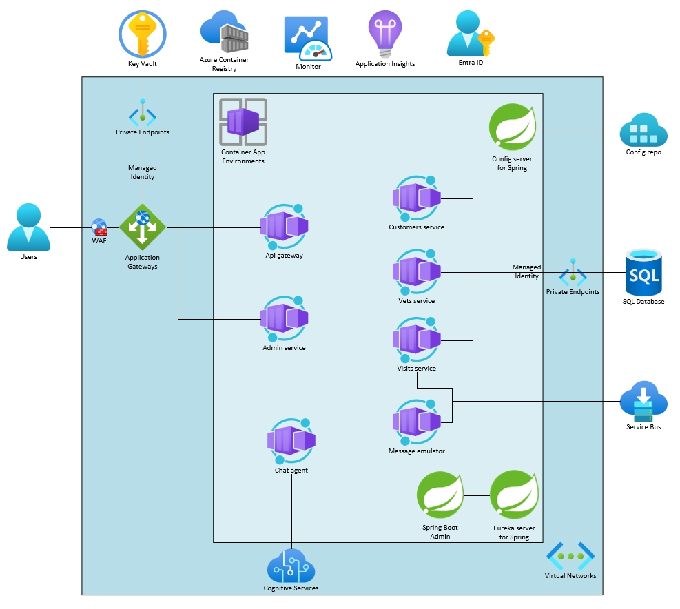

# Deploying and running Java Applications with AI in Azure Container Apps

This project shows how to deploy the [Spring Petclinic Microservices](https://github.com/Azure-Samples/java-microservices-aca-lab/tree/main/src) application with OpenAI to [Azure Container Apps](https://learn.microsoft.com/azure/container-apps/overview) and integrate it with additional Azure services, also some samples for Azure Container Apps features.

[Features](#features) • [Gettting Started](#getting-started) • [Guidance](#guidance)

## Important Security Notice

This template, the application code and configuration it contains, has been built to showcase Microsoft Azure specific services and tools. We strongly advise our customers not to make this code part of their production environments without implementing or enabling additional security features.  

For a more comprehensive list of best practices and security recommendations for Intelligent Applications, visit [Azure security best practices and patterns](https://learn.microsoft.com/en-us/azure/security/fundamentals/best-practices-and-patterns), [Azure security baseline for Intelligent Recommendations](https://learn.microsoft.com/en-us/security/benchmark/azure/baselines/intelligent-recommendations-security-baseline)

## Features

This project provides the following features:

* A spring petclinic microservices deployment on Azure Spring Apps with AI chat agent.
* Azure Container Apps java components ([eureka server](https://learn.microsoft.com/en-us/azure/container-apps/java-eureka-server-usage) /[config server](https://learn.microsoft.com/en-us/azure/container-apps/java-config-server-usage) / [spring boot admin](https://learn.microsoft.com/en-us/azure/container-apps/java-admin-for-spring-usage)) support.
* [Bicep files](https://docs.microsoft.com/azure/azure-resource-manager/bicep/) for provisioning Azure resources, including Azure OpenAI, Azure Container Apps, Azure Database for MySQL - Flexible Server, Azure Container Registry, Azure Log Analytics, Azure Application Insights and RBAC roles.
* Best practices to build more secure, more flexible more reliable java apps on Azure Spring Apps.
* AI chat agent to take advantage of large-scale, generative AI models with deep understandings of language and code to enable new reasoning and comprehension capabilities.

### Architecture Diagram

## Getting Started

You have a few options for getting started with this template. 

* [Using a GitHub codespace](#using-a-github-codespace)
* [Using Visual Studio Code with remote containers option](#using-visual-studio-code-with-remote-containers)
* [Install all the tools on your local machine](#install-all-the-tools-on-your-local-machine)

All the steps of this lab have been tested in the GitHub CodeSpace. This is the preferred option for running this lab!

## Guidance

### Prerequisites

For running this lab you will need:

* A GitHub account
* An Azure Subscription

### Region Availability

This template uses [Azure OpenAI Service](https://learn.microsoft.com/en-us/azure/ai-services/openai/overview) deployment mododules **gpt-4o** and **text-embedding-ada-002** which may not be available in all Azure regions. Check for [up-to-date region availability](https://learn.microsoft.com/azure/ai-services/openai/concepts/models#standard-deployment-model-availability) and select a region during deployment accordingly

  * We recommend using **East US**, **East US 2**, **North Central US**, **South Central US**, **Sweden Central**, **West US** and **West US 3**.

### Costs

You can estimate the cost of this project's architecture with [Azure's pricing calculator](https://azure.microsoft.com/pricing/calculator/)

* Azure Container Apps - [Consumption](https://azure.microsoft.com/en-us/pricing/details/container-apps/)
* Azure Database for MySQL - [Flexible Server](https://azure.microsoft.com/en-us/pricing/details/mysql/)
* Azure OpenAI Service - [Standard](https://azure.microsoft.com/en-us/pricing/details/cognitive-services/openai-service/)
* Azure Monitor - [Analytics Logs](https://azure.microsoft.com/en-us/pricing/details/monitor/)

### Security

This template has [Managed Identity](https://learn.microsoft.com/entra/identity/managed-identities-azure-resources/overview) built in to eliminate the need for developers to manage these credentials. Applications can use managed identities to obtain Microsoft Entra tokens without having to manage any credentials. Additionally, we have added a [GitHub Action tool](https://github.com/microsoft/security-devops-action) that scans the infrastructure-as-code files and generates a report containing any detected issues. To ensure best practices in your repo we recommend anyone creating solutions based on our templates ensure that the [Github secret scanning](https://docs.github.com/code-security/secret-scanning/about-secret-scanning) setting is enabled in your repos.

## Resources

* [Deploying and running Java Applications with AI in Azure Container Apps](https://azure-samples.github.io/java-microservices-aca-lab/)