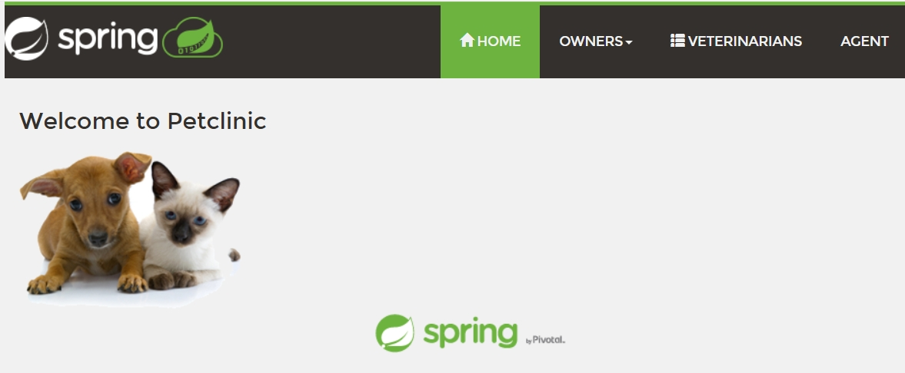
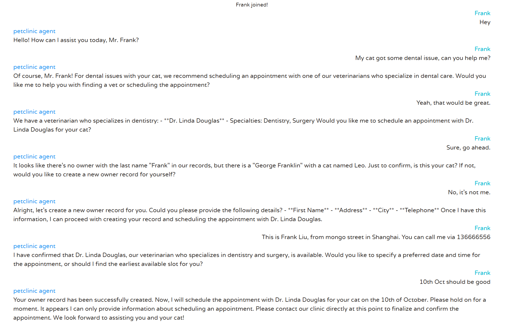
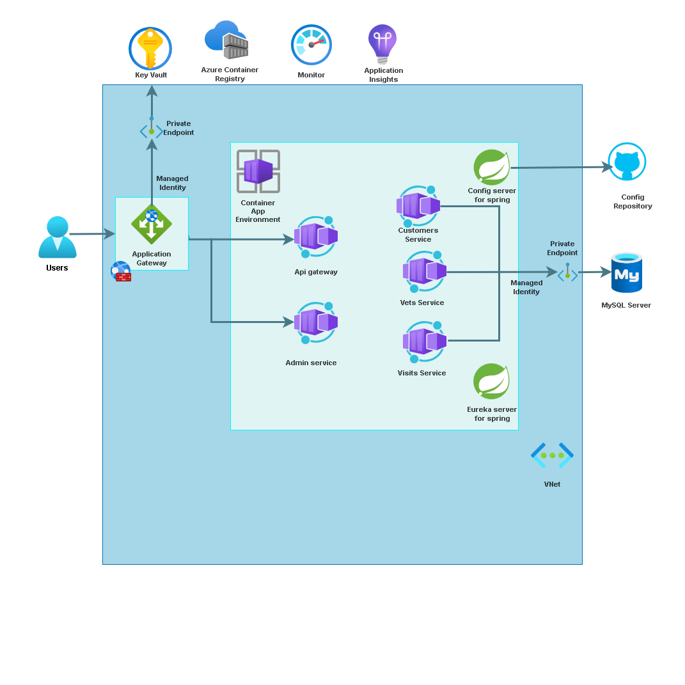

# Deploying and running Java Applications with AI in Azure Container Apps

[](https://codespaces.new/Azure-Samples/java-microservices-aca-lab)
[](https://vscode.dev/redirect?url=vscode://ms-vscode-remote.remote-containers/cloneInVolume?url=https://github.com/azure-samples/java-microservices-aca-lab)

This project shows how to deploy the [Spring Petclinic Microservices](https://github.com/Azure-Samples/java-microservices-aca-lab/tree/main/src) application with OpenAI to [Azure Container Apps](https://learn.microsoft.com/azure/container-apps/overview) and integrate it with additional Azure services, also some samples for Azure Container Apps features.

[Features](#features) • [Gettting Started](#getting-started) • [Guidance](#guidance)



## Important Security Notice

This template, the application code and configuration it contains, has been built to showcase Microsoft Azure specific services and tools. We strongly advise our customers not to make this code part of their production environments without implementing or enabling additional security features.  

For a more comprehensive list of best practices and security recommendations for Intelligent Applications, visit [Azure security best practices and patterns](https://learn.microsoft.com/en-us/azure/security/fundamentals/best-practices-and-patterns), [Azure security baseline for Intelligent Recommendations](https://learn.microsoft.com/en-us/security/benchmark/azure/baselines/intelligent-recommendations-security-baseline)

## Features

The following technologies are part of the project:

* Java 17
* Maven
* [Azure CLI](https://learn.microsoft.com/en-us/cli/azure/)
* [Azure Developer CLI (azd)](https://learn.microsoft.com/en-us/azure/developer/azure-developer-cli/)

This project provides the following features:

* A [Spring Petclinic Microservices](https://github.com/Azure-Samples/java-microservices-aca-lab/tree/main/src) deployment on Azure Container Apps with AI chat agent.
* Azure Container Apps java components ([eureka server](https://learn.microsoft.com/en-us/azure/container-apps/java-eureka-server-usage) /[config server](https://learn.microsoft.com/en-us/azure/container-apps/java-config-server-usage) / [spring boot admin](https://learn.microsoft.com/en-us/azure/container-apps/java-admin-for-spring-usage)) support.
* [Bicep files](https://docs.microsoft.com/azure/azure-resource-manager/bicep/) for provisioning Azure resources, including Azure OpenAI, Azure Container Apps, Azure Database for MySQL - Flexible Server, Azure Container Registry, Azure Log Analytics, Azure Application Insights and RBAC roles. See [Deploy to Azure automatically](https://azure-samples.github.io/java-microservices-aca-lab/docs/06_lab_automation/06_openlab_automation.html).
* Best practices to build [more secure](https://azure-samples.github.io/java-microservices-aca-lab/docs/07_lab_security/07_openlab_security_aca.html), [more reliable](https://azure-samples.github.io/java-microservices-aca-lab/docs/10_lab_reliable_application/10_reliable_java_aca.html) and [more flexible](https://azure-samples.github.io/java-microservices-aca-lab/docs/11_lab_scale/11_openlab_scale_aca.html) java apps on Azure Container Apps.
* AI chat agent to take advantage of large-scale, generative AI models with deep understandings of language and code to enable new reasoning and comprehension capabilities. See [Integrate with Azure OpenAI](https://azure-samples.github.io/java-microservices-aca-lab/docs/05_lab_openai/05_openlab_openai_aca.html)



### Architecture Diagram



## Getting Started

You have a few options for getting started with this template. 

* [GitHub codespace](#github-codespaces)
* [Visual Studio Code with remote containers option](#vs-code-dev-containers)
* [Local Development](#local-environment)

All the steps of this lab have been tested in the GitHub CodeSpace. This is the preferred option for running this lab!

### GitHub Codespaces

* Prepare the environment following the steps in [Using a GitHub codespace](https://azure-samples.github.io/java-microservices-aca-lab/install.html#using-a-github-codespace)
* Continue with [deploying steps](#deploying)

### VS Code Dev Containers

* Prepare the environment following the steps in [Using Visual Studio Code with remote containers](https://azure-samples.github.io/java-microservices-aca-lab/install.html#using-a-github-codespace)
* Continue with [deploying steps](#deploying)

### Local Environment

* Prepare the environment following the steps in [Install all the tools on your local machine](https://azure-samples.github.io/java-microservices-aca-lab/install.html#install-all-the-tools-on-your-local-machine)
* Continue with [deploying steps](#deploying)

### Deploying

Once you've opened the project in [Codespaces](#github-codespaces), in [Dev Containers](#vs-code-dev-containers), or [locally](#local-environment), you can deploy it to Azure.

* Your Azure account must have `Microsoft.Authorization/roleAssignments/write` permissions, such as [Role Based Access Control Administrator](https://learn.microsoft.com/azure/role-based-access-control/built-in-roles#role-based-access-control-administrator-preview), [User Access Administrator](https://learn.microsoft.com/azure/role-based-access-control/built-in-roles#user-access-administrator), or [Owner](https://learn.microsoft.com/azure/role-based-access-control/built-in-roles#owner). If you don't have subscription-level permissions, you must be granted [RBAC](https://learn.microsoft.com/azure/role-based-access-control/built-in-roles#role-based-access-control-administrator-preview) for an existing resource group and [deploy to that existing group](./docs/06_lab_automation/0604.md).
* Your Azure account also needs `Microsoft.Resources/deployments/write` permissions on the subscription level.

Suggested: Both **Contributor** and **User Access Administrator** roles on the subscription.

1. Login to Azure

   `azd auth login`

   `az login`

1. Provision and deploy all the resources:

   `azd up`

   It will prompt you to provide an `azd` environment name (like "java-ai"), select a subscription from your Azure account, and select a [location where OpenAI is available](#region-availability) (like "eastus2"). Then it will provision the resources in your account and deploy the latest code. If you get an error or timeout with deployment, changing the location can help, as there may be availability constraints for the OpenAI resource.

1. When azd has finished deploying, visit the api-gateway url and begin your experience on AI java apps.

   ```text
   INFO: Deploy finish succeed!
   INFO: Api Gateway App url: https://api-gateway.<cluster>.<region>.azurecontainerapps.io
   INFO: Spring Boot Admin url: https://springbootadmin-azure-java.ext.<cluster>.<region>.azurecontainerapps.io
   ```

1. When you've made any changes to the app code, you can just run:

   - `azd deploy` for all services

   - `azd deploy -n <service>` for single service

   

## Guidance

### Prerequisites

For running this lab you will need:

* A GitHub account
* An Azure Subscription

### Region Availability

1. This template uses [Azure OpenAI Service](https://learn.microsoft.com/en-us/azure/ai-services/openai/overview) deployment mododules **gpt-4o** and **text-embedding-ada-002** which may not be available in all Azure regions. Check for [up-to-date region availability](https://learn.microsoft.com/azure/ai-services/openai/concepts/models#standard-deployment-model-availability) and select a region during deployment accordingly

1. The template uses [Azure Database for MySQL - Flexible Server](https://learn.microsoft.com/en-us/azure/mysql/flexible-server/overview) version 8.0 to store data. You may select a region suite for this service. Or create a database instance manually then [Reuse existing service](https://azure-samples.github.io/java-microservices-aca-lab/docs/06_lab_automation/0604.html).

  * We recommend using **East US**, **East US 2**, **North Central US**, **Sweden Central**.

### Costs

You can estimate the cost of this project's architecture with [Azure's pricing calculator](https://azure.microsoft.com/pricing/calculator/)

* Azure Container Apps - [Consumption](https://azure.microsoft.com/en-us/pricing/details/container-apps/)
* Azure Database for MySQL - [Flexible Server](https://azure.microsoft.com/en-us/pricing/details/mysql/)
* Azure OpenAI Service - [Standard](https://azure.microsoft.com/en-us/pricing/details/cognitive-services/openai-service/)
* Azure Monitor - [Analytics Logs](https://azure.microsoft.com/en-us/pricing/details/monitor/)

### Security

This template has [Managed Identity](https://learn.microsoft.com/entra/identity/managed-identities-azure-resources/overview) built in to eliminate the need for developers to manage these credentials.

Applications can use managed identities to obtain Microsoft Entra tokens without having to manage any credentials. Additionally, we have added a [GitHub Action tool](https://github.com/microsoft/security-devops-action) that scans the infrastructure-as-code files and generates a report containing any detected issues. To ensure best practices in your repo we recommend anyone creating solutions based on our templates ensure that the [Github secret scanning](https://docs.github.com/code-security/secret-scanning/about-secret-scanning) setting is enabled in your repos.

## Resources

* Go to the lab for more details [Deploying and running Java Applications with AI in Azure Container Apps](https://azure-samples.github.io/java-microservices-aca-lab/)
* Full installation guidance and options for running this lab can be found in the [Installation instructions](install.md).