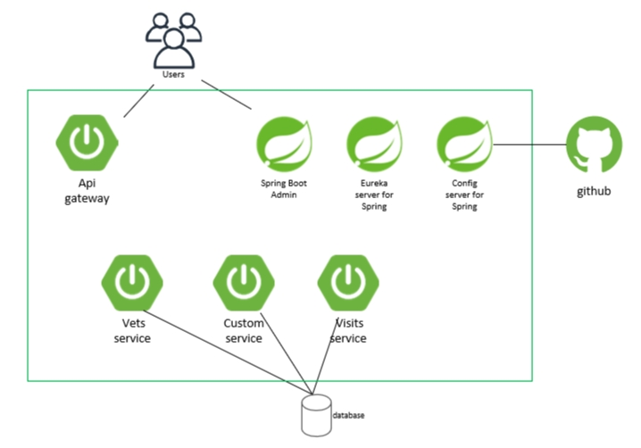

# Examine the application components based on the information provided in its GitHub repository

To start, you will learn about the existing Spring Petclinic application.

1. The components of the microservice application

   

   - Spring boot services including vets service, customer service, visits service and AI chat agent.
   - A gateway service role as the spring gateway to route the requests.
   - Spring boot components including Eureka Server, Congfig Server and the Spring Boot Admin.
   - External github repo and database.

1. In the web browser displaying the GitHub repo, navigate to each folder containing the code of the individual spring-petclinic-* services and review their content. You don't need to know their full details, but you should understand their basic structure.

1. Make sure you create a local copy of this project for you to work in during the lab. You may also want to push this local copy to a git repository you own.

## Step by step guidance

1. On your lab computer, start a web browser and navigate to [GitHub](https://github.com) and sign in to your GitHub account. If you do not have a GitHub account, create one by navigating to [the Join GitHub page](https://github.com/join) and following the instructions provided on [the Signing up for a new GitHub account page](https://docs.github.com/en/get-started/signing-up-for-github/signing-up-for-a-new-github-account).

1. For the next install and setup steps use the guidance in the [Installation]() instructions.
