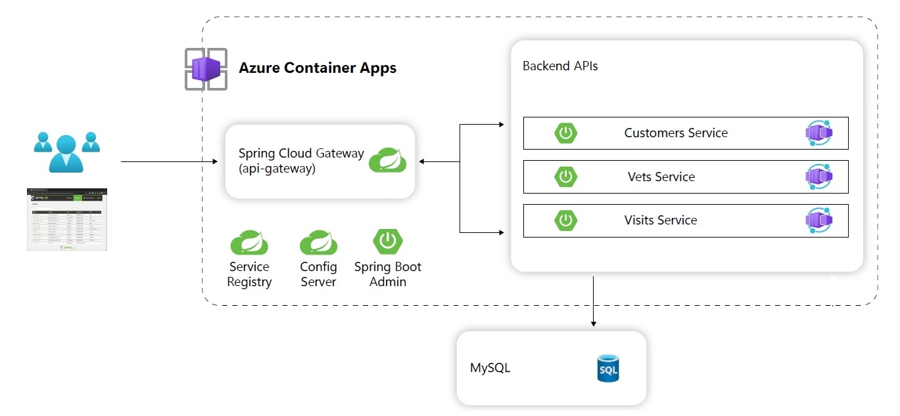

# Understand the Azure resources that you’ll use

Now that you’ve familiarized yourself with the example Spring Petclinic Microservices workload that you’ll be deploying, you can explore the Azure services that you’ll use to host it.

## Azure Container Apps

For this deployment, we’re going to use [Azure Container Apps](https://learn.microsoft.com/azure/container-apps/overview) to run the [Spring Petclinic Microservices](https://github.com/spring-petclinic/spring-petclinic-microservices) application. Azure Container Apps is a good choice in this scenario because:

-   It’s a serverless hosting platform that allows you to maintain less infrastructure and save costs while running containerized applications. This means that instead of worrying about server configuration, container orchestration, and deployment details, Container Apps provides all the up-to-date server resources required to keep your applications stable and secure.
-   It supports native Spring Boot applications and Spring Boot–managed components that we’ll use in our app, like [Eureka Server](https://learn.microsoft.com/azure/container-apps/java-eureka-server?tabs=azure-cli), [Config Server](https://learn.microsoft.com/azure/container-apps/java-config-server?tabs=azure-cli), and [Spring Boot Admin](https://learn.microsoft.com/azure/container-apps/java-admin?tabs=azure-cli).
-   It supports [Gateway for Spring](https://learn.microsoft.com/azure/container-apps/java-gateway-for-spring), which serves as a key component of our application’s architecture.
-   In addition, Azure Container Apps has other features that allow us to deploy and operate our application more securely, including:
    -   [Managed identity](https://learn.microsoft.com/azure/container-apps/managed-identity)
    -   Service connections

In this lab, we’ll use Azure Container Apps to host the various components that you reviewed in the previous section. Our API gateway application will handle external user requests, routing them to the appropriate back-end applications, which are each running in their own container app.

Using Azure Container Apps, you’ll be able to host the workload's entire architecture with a minimal amount of management work. This allows you to focus on the applications while Azure Container Apps takes care of all the managed Spring components.

The following diagram shows how the various Spring Boot components will interact within the Azure Container Apps host once you deploy them.

## Other Azure services for building and operating the application

In addition to Azure Container Apps, you’ll use several other Azure services to help you deploy and manage the application, including:

-   [Azure Container Registry](https://learn.microsoft.com/azure/container-registry/container-registry-intro), which is a managed registry service based on the open-source Docker Registry 2.0. You’ll use it to build and save the images that Azure Container Apps uses to create the various containerized applications that make up the combined workload.
-   [Azure Database for MySQL - Flexible Server](https://learn.microsoft.com/azure/mysql/flexible-server/overview), which is a fully managed, production-ready relational database service in Azure. It's based on the [MySQL Community Edition](https://www.mysql.com/products/community/) database engine (available under the GPLv2 license). This service lets you create a MySQL database instance that the various application components will use.
-   [Azure Monitor](https://learn.microsoft.com/azure/azure-monitor/overview) is a comprehensive solution for collecting, analyzing, and responding to monitoring data from your Azure-based applications. To monitor your app, you’ll use several of its features, including:
    -   [Log Analytics](https://learn.microsoft.com/azure/azure-monitor/logs/log-analytics-overview), which allows you to run and edit log queries against data in the Azure Monitor Logs store, using the Azure portal as a management interface.
    -   [Application Insights](https://learn.microsoft.com/azure/azure-monitor/app/app-insights-overview), a feature of Azure Monitor that provides real-time analytics, including performance tracking, error logging, and usage insights, enabling developers to quickly detect and diagnose issues.
    -   [Azure Managed Grafana](https://learn.microsoft.com/azure/managed-grafana/overview), which is a fully managed data visualization platform built on top of Grafana software originally created by Grafana Labs. The platform allows you to view and analyze your Azure-hosted application and infrastructure telemetry data in real time.
