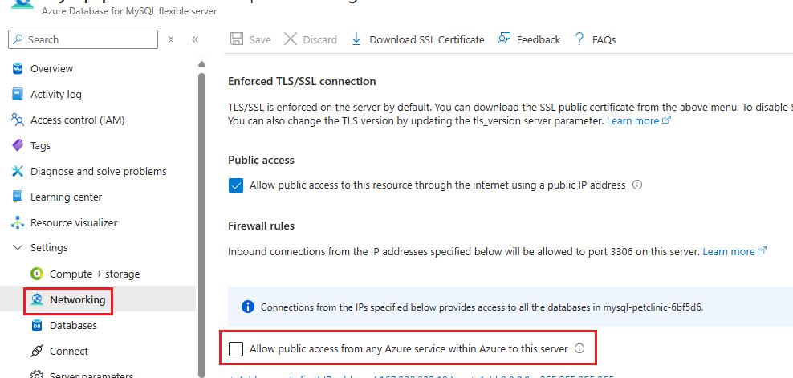

# Create an Azure Database for MySQL instance

You now have the compute service in place to host your applications. Before you start deploying individual Spring applications as container apps, you need to first create an Azure Database for MySQL - Flexible Server–hosted database for them.

By default, the MySQL database you create will have a firewall enabled that will block all incoming calls. To ensure your applications work, you'll add firewall rules allowing them to connect after you create the database.

{: .note}
> To learn more about deploying Azure Database for MySQL - Flexible Server, review [Quickstart: Create an instance of Azure Database for MySQL - Flexible Server using the Azure CLI](https://learn.microsoft.com/azure/mysql/flexible-server/quickstart-create-server-cli).

## Step-by-step guidance

1.  To create an Azure Database for MySQL - Flexible Server instance, run the following commands. Replace the \<*sqladmin-password*\> placeholder with a complex password, and record its value.

    {: .note }
    > The server name must be globally unique, so if the randomly generated name is already in use, adjust it accordingly . Keep in mind that the name can contain only lowercase letters, numbers, and hyphens.

    {: .note }
    > For simplicity’s sake, in this lab, we’re using a MySQL admin password to allow apps to connect to MySQL Server. However, we don’t recommend this when operating in a production environment. For the secured managed identity solution, refer to [Lab 04: Connect to a database securely using managed identity]().

    ```bash
    MYSQL_SERVER_NAME=mysql-$APPNAME-$UNIQUEID
    MYSQL_ADMIN_USERNAME=sqladmin
    MYSQL_ADMIN_PASSWORD="<sqladmin-password>"
    DATABASE_NAME=petclinic

    az mysql flexible-server create \
        --admin-user "$MYSQL_ADMIN_USERNAME" \
        --admin-password "$MYSQL_ADMIN_PASSWORD" \
        --name "$MYSQL_SERVER_NAME" \
        --resource-group "$RESOURCE_GROUP" \
        --public-access none \
        --yes
    ```

    {: .note }
    > Wait for the provisioning to complete. This usually takes around three minutes.

    {: .note }
    > If the command fails and you get the message, “No available SKUs in this location,” try again with a different region by adding the following line to the command: \--location \<*another-region*\>. It’s OK to create the MySQL Server in a different region from your other resources.

2.  To create the database that your applications will use, run the following commands:

    ```bash
    az mysql flexible-server db create \
        --server-name $MYSQL_SERVER_NAME \
        --resource-group $RESOURCE_GROUP \
        -d $DATABASE_NAME
    ```

3.  After creating the Azure Database for MySQL - Flexible Server instance, you’ll need to update the firewall settings to allow connections from your Container Apps environment. For now, you’ll create a server firewall rule to allow inbound traffic from all Azure services.

    Check the status of your MySQL Server. 

    Select the `Allow public access from any Azure service within Azure to this server` checkbox. This adds an IP-based firewall rule with a start and end IP address of 0.0.0.0 (refer to [Connections from inside Azure](https://learn.microsoft.com/azure/azure-sql/database/firewall-configure?view=azuresql#connections-from-inside-azure)).

    If this checkbox is not set by default for your MySQL Server, set it by selecting the checkbox and then selecting `Save`. Alternatively, set it by running the following command:

    ```bash
    az mysql flexible-server firewall-rule create \
        --rule-name allAzureIPs \
        --name $MYSQL_SERVER_NAME \
        --resource-group $RESOURCE_GROUP \
        --start-ip-address 0.0.0.0 --end-ip-address 0.0.0.0
    ```