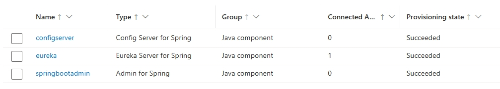

# Create the Java components for your config and discovery server

As a next step, you’ll configure the config, discovery, and admin applications. These are available as built-in components of Azure Container Apps.

To learn more about how to configure these applications, refer to:

- [Tutorial: Connect to a managed Config Server for Spring in Azure Container Apps](https://learn.microsoft.com/azure/container-apps/java-config-server)
- [Tutorial: Connect to a managed Eureka Server for Spring in Azure Container Apps](https://learn.microsoft.com/azure/container-apps/java-eureka-server)
- [Tutorial: Connect to a managed Admin for Spring in Azure Container Apps](https://learn.microsoft.com/en-us/azure/container-apps/java-admin)

## Step-by-step guidance

1.  Create the Spring Cloud Config Server Java component. You’ll need to pass the Git repo information you defined back in the [Config repo]() step to correctly load your configuration information.

    ```bash
    JAVA_CONFIG_COMP_NAME=configserver
    az containerapp env java-component config-server-for-spring create \
        --environment $ACA_ENVIRONMENT \
        --resource-group $RESOURCE_GROUP \
        --name $JAVA_CONFIG_COMP_NAME \
        --configuration spring.cloud.config.server.git.uri=$GIT_URI spring.cloud.config.server.git.search-paths=$SEARCH_PATH spring.cloud.config.server.git.default-label=$LABEL
    ```

1.  Check the Spring Cloud Config Server Java component to confirm that it was successfully created.

    ```bash
    az containerapp env java-component config-server-for-spring show \
        --environment $ACA_ENVIRONMENT \
        --resource-group $RESOURCE_GROUP \
        --name $JAVA_CONFIG_COMP_NAME
    ```

1.  Next, you’ll create the Spring Cloud Eureka Server Java component. This will create a standard Eureka endpoint within your Container Apps environment. The Spring Petclinic workload will use this for discovery services.

    ```bash
    JAVA_EUREKA_COMP_NAME=eureka
    az containerapp env java-component eureka-server-for-spring create \
        --environment $ACA_ENVIRONMENT \
        --resource-group $RESOURCE_GROUP \
        --name $JAVA_EUREKA_COMP_NAME \
        --configuration eureka.server.response-cache-update-interval-ms=10000
    ```

1.  The Admin for Spring managed component offers an administrative interface for Spring Boot web applications that exposes actuator endpoints. You’ll create a new Spring Boot Admin application and bind it to the Eureka Server you just created.

    ```bash
    JAVA_SBA_COMP_NAME=springbootadmin
    az containerapp env java-component admin-for-spring create \
        --environment $ACA_ENVIRONMENT \
        --resource-group $RESOURCE_GROUP \
        --name $JAVA_SBA_COMP_NAME \
        --bind $JAVA_EUREKA_COMP_NAME \
        --min-replicas 1 \
        --max-replicas 1
    ```

1.  Confirm that all three servers were successfully created using the portal. 

    In your web browser, go to the [Azure portal](http://portal.azure.com/) and access your Azure Container Apps environment. Then open `Services` \> `Services`, and you should find the components that you just created.

    

{: .note }
> Although Azure Container Apps has an internal naming mechanism for allowing applications to call each other, the Eureka Server component is very handy if you’re ever migrating an existing Spring Cloud application and you want to keep working with your current naming mechanism between component applications. In other cases, you can choose to just use the internal naming mechanism that Container Apps already provides.

