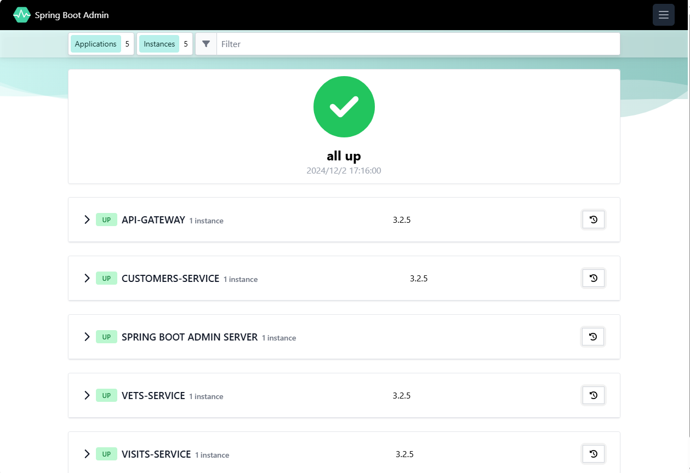
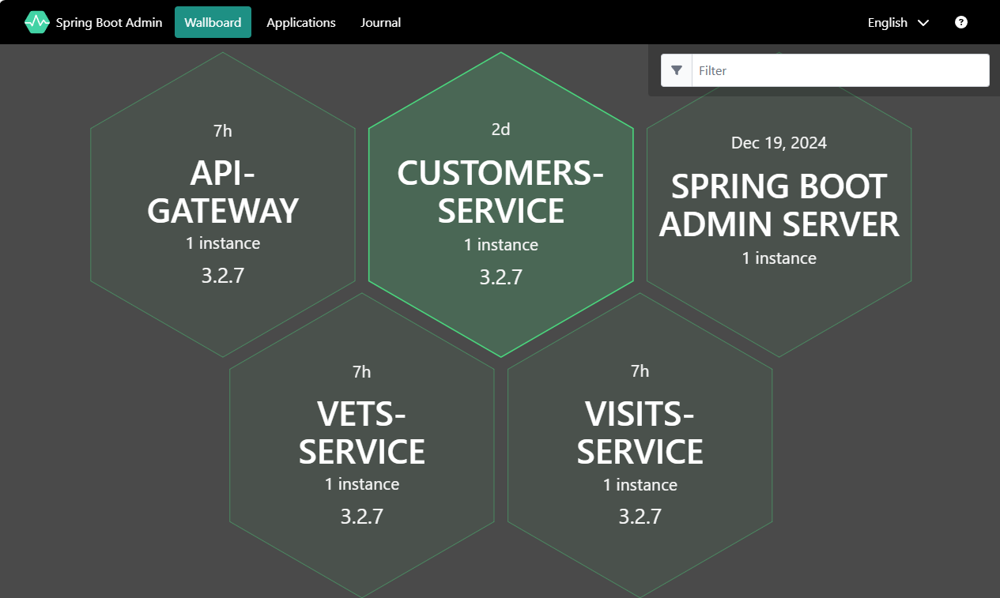
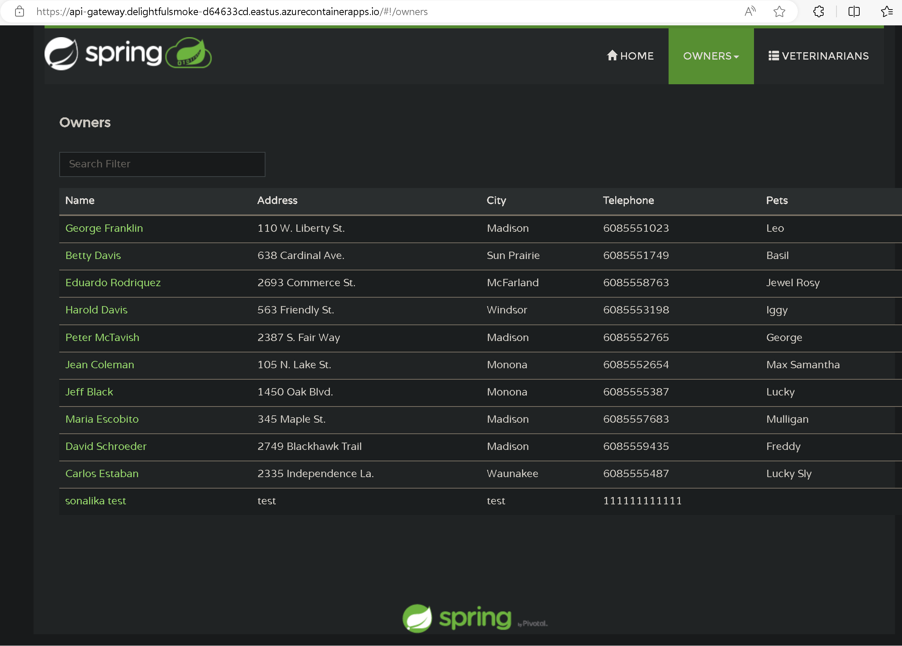

# Test the applications through the public endpoint

Now that you’ve deployed each of the sample workload's component applications, you’ll test them to determine whether they’re working correctly. If you run into problems, inspect the Container Apps environment logs to figure out what might be missing.

For more information on your Container Apps environment, follow the [az containerapp show](https://learn.microsoft.com/cli/azure/containerapp?view=azure-cli-latest#az-containerapp-show) guidance.

## Step-by-step guidance

1.  In your web browser, go to the [Azure portal](http://portal.azure.com/).

    Go to `Resource groups`, and select the resource group you created for this app.

    Check the resources created for each of the applications.

1.  Users will access the app through the api-gateway, which you previously configured to accept external traffic. To test that it’s working correctly, you’ll need to open it in your browser. To find its address, go to the Azure portal and find the application URL for the api-gateway container app. Alternatively you can run the following CLI command to get the URL:

    ```bash
    api_gateway_FQDN=$(az containerapp show \
        --resource-group $RESOURCE_GROUP \
        --name api-gateway \
        --query properties.configuration.ingress.fqdn \
        -o tsv)

    echo https://$api_gateway_FQDN
    ```

1.  You created the Spring Boot Admin component in your Azure Container Apps environment. To test this app, go to the portal and locate your Azure Container Apps environment. To find the Admin for Spring service, under `Settings` \> `Services`, get the Admin dashboard URL. Alternatively, use the following CLI:

    ```bash
    sba_FQDN=$(az containerapp env java-component admin-for-spring show \
        --environment $ACA_ENVIRONMENT \
        --resource-group $RESOURCE_GROUP \
        --name $JAVA_SBA_COMP_NAME \
        --query properties.ingress.fqdn \
        -o tsv)

    echo https://$sba_FQDN
    ```

    Before you go to the Spring Boot Admin dashboard, assign a role to your account.

    - Go to the portal, and find your Azure Container Apps environment.
    - In the left menu, select `Access control (IAM)` and then select `Add` \> `Add role assignment`.
    - In the `Role` tab, search and select `Container Apps ManagedEnvironments Contributor`. On the Members tab, select assignee type `User`, `group`, or `service principal`, and then search and select your account using the Select members menu.
    - Select Review + Assign to finish assigning the role.

    Alternatively, you can use the following CLI command to assign the roll:

    ```bash
    az role assignment create --assignee $USER_NAME --scope $ACA_ENVIRONMENT_ID --role 'Container Apps ManagedEnvironments Contributor'
    ```

1.  In a browser window, connect to the Admin app URL. This shows your applications’ running info.

    

    Select _Wallboard_ and then select one of the component applications. The Admin server will then show you internal info for that apps.

    

1.  Use a browser window to connect to the `api-gateway`. This will allow you to test the combined example Spring Petclinic applications.

    

1.  If you aren’t finding data in your application, you can troubleshoot this issue by interactively connecting to your Azure Database for MySQL - Flexible Server and querying your databases and tables.

    ```bash
    az mysql flexible-server connect -n $MYSQL_SERVER_NAME -u $MYSQL_ADMIN_USERNAME --interactive
    ```

    To sign in, enter your MYSQL_ADMIN_PASSWORD. Once connected you can use queries like the following to test the database:

    ```text
    show databases;
    use petclinic;
    show tables;
    select * from owners;
    ```

    {: .note }
    > For the Azure Database for MySQL - Flexible Server connection to work, you’ll need to have your local IP address added to the [Azure Database for MySQL - Flexible Server firewall allowed list](https://learn.microsoft.com/azure/mysql/flexible-server/how-to-manage-firewall-portal).
