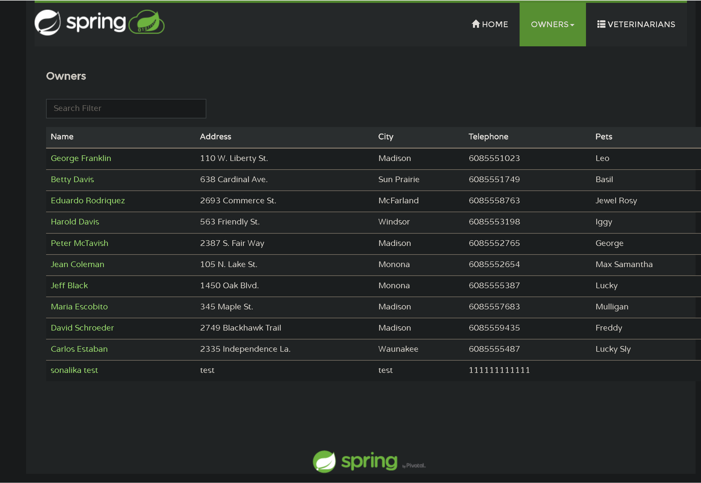

# Test the application through the public endpoint

Now that you deployed each of the microservices, you will test them out to see if they were deployed correctly. In case they are not working as expected, inspect the logs to figure out what might be missing. You can follow the below guidance to do so.

- [az containerapp show](https://learn.microsoft.com/cli/azure/containerapp?view=azure-cli-latest#az-containerapp-show)

## Step by step guidance

1. In your browser navigate to the [Azure portal](http://portal.azure.com).

   Navigate to Resource Groups and select the resource group for the apps.

   Check the resources created for the microservices.

1. You configured the _api-gateway_ with an external ingress. You can go to the portal and check application url for api-gateway container app.

   ```bash
   api_gateway_FQDN=$(az containerapp show \
     --resource-group $RESOURCE_GROUP \
     --name api-gateway \
     --query properties.configuration.ingress.fqdn \
      -o tsv)

   echo $api_gateway_FQDN
   ```

1. You created the spring boot admin component in your azure container environment. You can go to the portal and locate your Azure Container Environment named $ACA_ENVIRONMENT, find the `Admin for Spring` service under Settings > Services, get the `Admin Dashboard` url.

   Or you can get the url with CLI:

   ```bash
   sba_FQDN=$(az containerapp env java-component admin-for-spring show \
     --environment $ACA_ENVIRONMENT \
     --resource-group $RESOURCE_GROUP \
     --name $JAVA_SBA_COMP_NAME \
     --query properties.ingress.fqdn \
      -o tsv)

   echo $sba_FQDN
   ```

   Before you visit the Spring Boot Admin dashboard, assign a role to your account.
   - Go to the portal and locate your Azure Container Environment named $ACA_ENVIRONMENT.
   - Select `Access control (IAM)` in the left menu, then select Add > Add role assignment.
   - In the role tab, search and select `Container Apps ManagedEnvironments Contributor`, in the Members page, select assignee type `User, group, or service principal`, search and select your account in the `Select members` pop window.
   - Follow the guide to `Review + Assign` the role.

   Or, use the command to assign the role

   ```bash
   az role assignment create --assignee $USER_NAME --scope $ACA_ENVIRONMENT_ID --role 'Container Apps ManagedEnvironments Contributor'
   ```

1. Use a browser window to connect to sba_FQDN. This will show the running info of your applications.

   

   Select _Wallboard_ and next one of your microservices. The Admin server will show you internal info of your services.

   

1. Use a browser window to connect to  _api-gateway_. It is the page of the petclinic.

   

   Now you have the Spring Petclinic application running properly on Azure Container Apps.

1. In case you are not seeing any data in your application, you can troubleshoot this issue by interactively connecting to your MySQL Flexible Server and querying your databases and tables.

   ```bash
   az mysql flexible-server connect -n $MYSQL_SERVER_NAME -u $MYSQL_ADMIN_USERNAME --interactive
   ```

   Input your `MYSQL_ADMIN_PASSWORD` to login. Here are some sample queries:

   ```text
   show databases;
   use petclinic;
   show tables;
   select * from owners;
   ```

   {: .note }
   > For the MySQL Flexible Server connection to work, you will need to have your local IP address added to the MySQL Flexible Server firewall allowed list.
