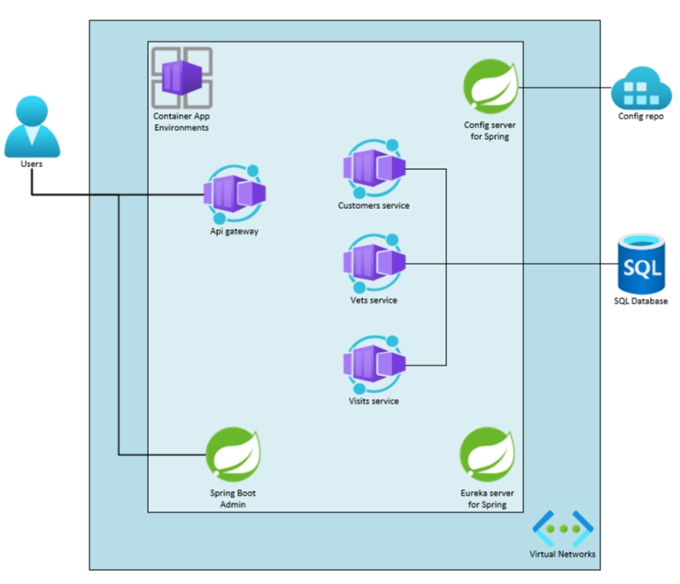

# Review

In this lab, you deployed the Spring Petclinic microservices application to Azure.

The below image illustrates the end state you have build in this lab.

## Save your environment variables

- This is the fundemental part for the next labs, please keep the azure resource undeleted.
- During this lab, we defined some environment variables, some of the variables are required in the next labs. To save these variables, in the command-line window, under the directory `spring-petclinic-microservices`, run the command `source ../.devcontainer/saveenv.sh`, this command will save the environment variables to file `~/.dev-environment`.
- The new bash environment will automatically pick up the saved environment variables. Also you can manually load the saved variables with command `source ~/.dev-environment`.
