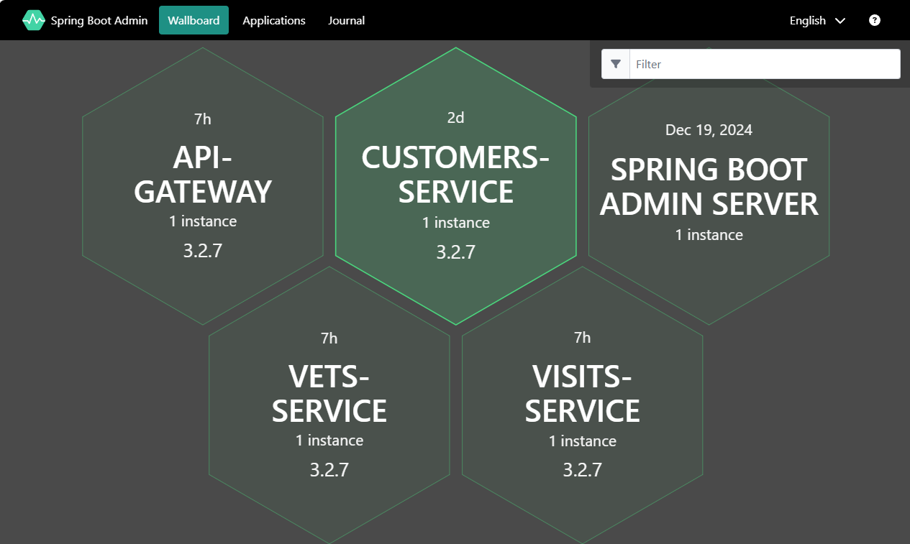

# Test the application through the publicly available endpoint

Now that you have deployed each of the microservices, you will test them out to see if they were deployed correctly. Also inspect wether all pods are properly up and running. In case they are not, inspect the logs to figure out what might be missing.

- [Get public endpoints (THIS LINK IS NOT CORRECT!!!)](https://docs.microsoft.com/azure/aks/kubernetes-walkthrough#test-the-application)

## Step by step guidance

1. You configured both the _api-gateway_ and the _admin-server_ with an external ingress. You can go to the portal and check application url for api_gateway and admin_server container app.

   ```bash
   
   api_gateway_FQDN=$(az containerapp show \
     --resource-group $RESOURCE_GROUP \
     --name api-gateway \
     --query properties.configuration.ingress.fqdn \
      -o tsv)
   

   admin_server_FQDN=$(az containerapp show \
     --resource-group $RESOURCE_GROUP \
     --name admin-server \
     --query properties.configuration.ingress.fqdn \
      -o tsv)

   echo $api_gateway_FQDN
   echo $admin_server_FQDN
   ```

1. Use a browser window to connect to admin_server_FQDN. This will show you info about each of your applications.

   

1. Select _Wallboard_ and next one of your microservices. The Admin server will show you internal info of your services.

   

1. Use a browser window to connect to  _api-gateway_. It should show you information on the pets and visits coming from your database.

   

   You now have the Spring Petclinic application running properly on the ACA.

1. In case you are not seeing any data in your application, you can troubleshoot this issue by interactively connecting to your MySQL Flexible Server and querying your databases and tables.

   ```bash
   az mysql flexible-server connect -n $MYSQL_SERVER_NAME -u myadmin -p $MYSQL_ADMIN_PASSWORD --interactive
   show databases;
   use petclinic;
   show tables;
   select * from owners;
   ```

   {: .note }
   > For the MySQL Flexible Server connection to work, you will need to have your local IP address added to the MySQL Flexible Server firewall.

   {: .note }
   > Once you got everything up and running, you are now probably very eager to push your code changed to a GitHub repository. Be mindful though when you do this: **Do not push your GitHub PAT token** (it's in the local `application.yml` file of the config-server) to a remote repository. It will immediately invalidate the PAT token and your config-server will start failing. You should exclude the `application.yml` file from your commit. You can also check out the [LabTips]() on how to recover from this in case you did accidentally push the PAT token to your remote repo.
