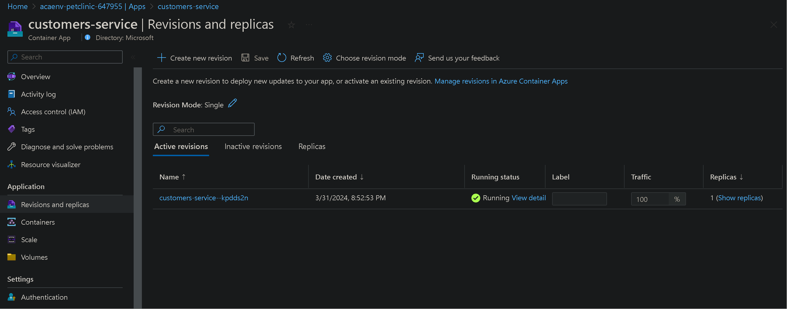

# Inspect your ACA service in the Azure Portal

By default the Azure Portal already gives you quite some info on the current status of the ACA instance. In this first part of this module, open the Azure Portal, navigate to one of your ACA instances and inspect what info you can find on the instance. Try and find information on:

- The ACA replica status.
- The live logs (console and system) of the `customers-service`.

You can follow the below guidance to do so.

- [log streams in Azure Container Apps]([https://learn.microsoft.com/azure/container-apps/log-streaming?tabs=bash])

## Step by step guidance

1. In your browser navigate to the Azure Portal, and to the resource group you deployed the Azure container App. Select the customers-service ACA.

1. In the menu under `Application`, select `Revisions and replicas`. Check the status of replica.

   

1. You can also see the live console logs. Click on Log stream under monitoring in left pane and select the `customers-service` from the drop down menu.

   

1. Click on system to see live system logs.

   
