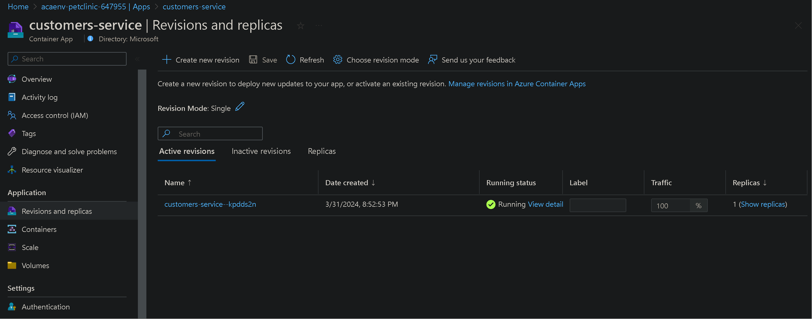
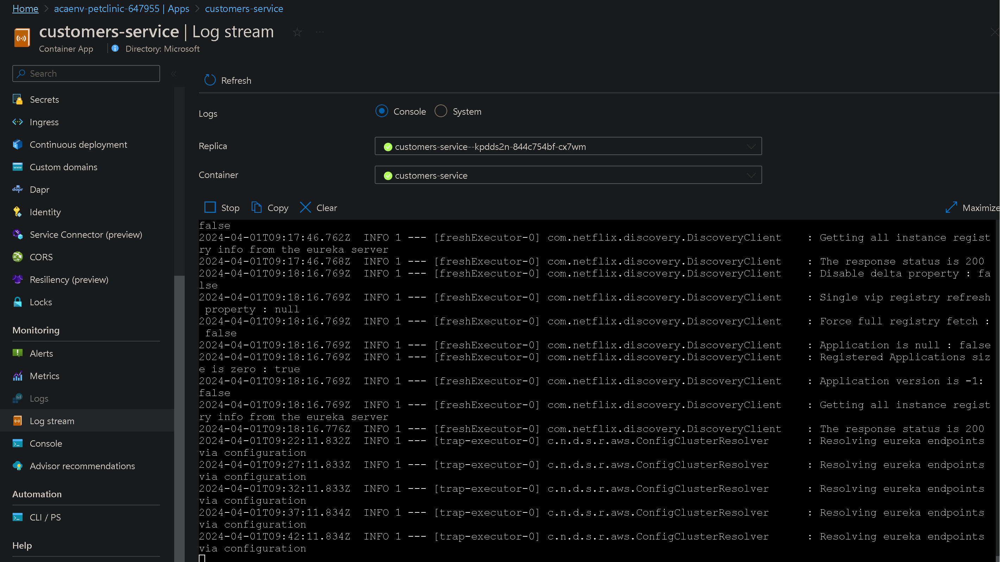
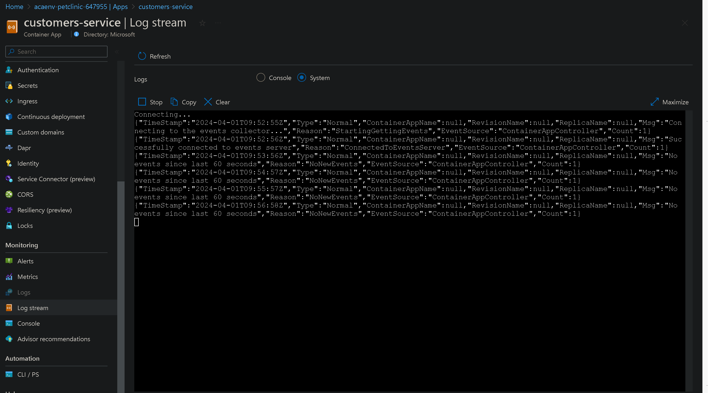

# Inspect your Azure Container Apps environment in the Azure portal

By default, the Azure portal gives you quite a bit of information on the status of your Container Apps instance. Before we explore adding monitoring capabilities, you should familiarize yourself with the provided logging information.

You’ll use the Azure portal to find information on:

- The revision status of your Container Apps environment.
- The live console and system logs of the `customers-service` container.

If you’d like to learn more about these types of logging, review [View log streams in Azure Container Apps](https://learn.microsoft.com/azure/container-apps/log-streaming?tabs=bash).

## Step-by-step guidance

1. In your web browser, go to the [Azure portal](http://portal.azure.com/) and then to the resource group where you deployed your Azure Container Apps environment. Select the `customers-service` container app.
1. In the menu, under Application, select `Revisions and replicas` and then check the status of any revisions.

   

1. You can also access the live console logs to view events as they happen. To do so, in the Azure portal, on the left pane, under Monitoring, select `Log stream`. From the dropdown menu, select `customers-service`.

   

1. To view the live system logs, select the `System` option.
   

