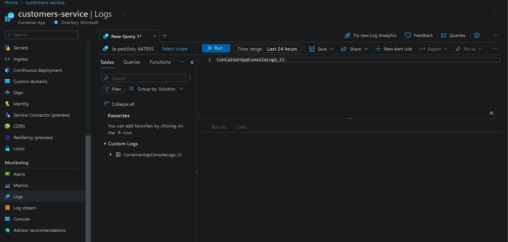
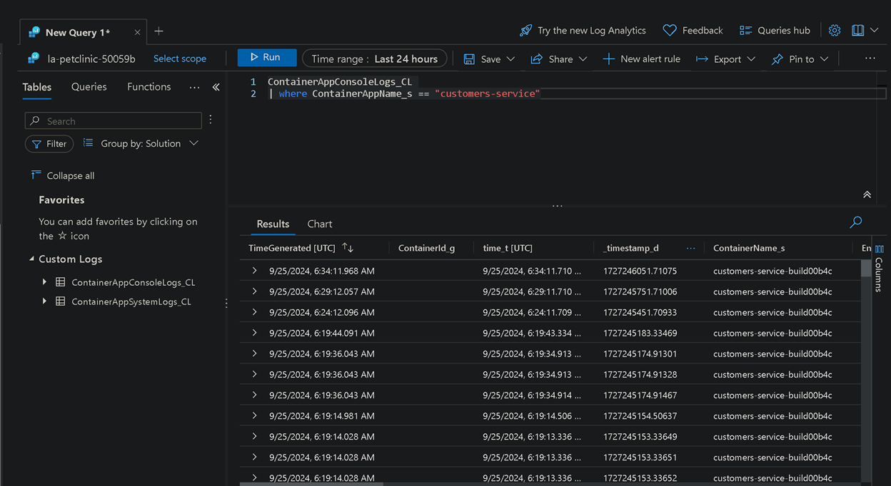
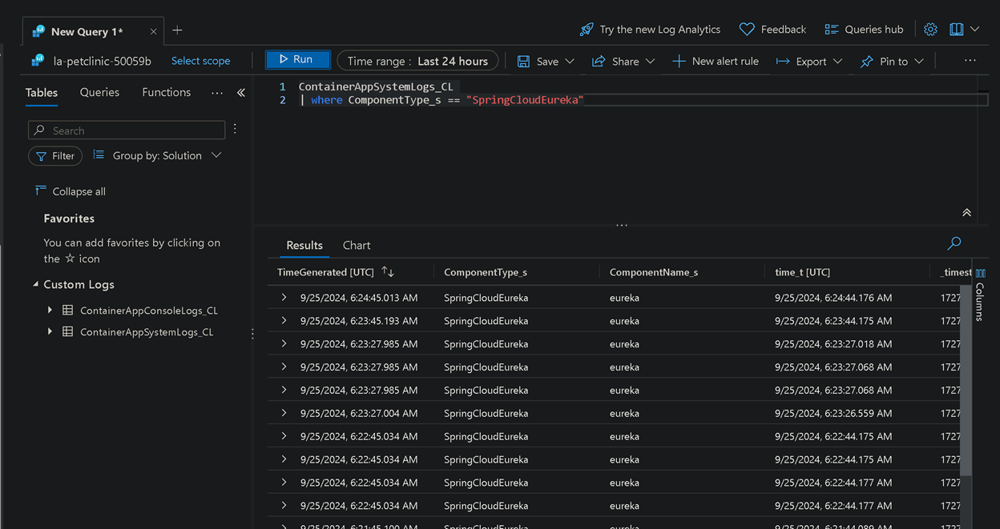
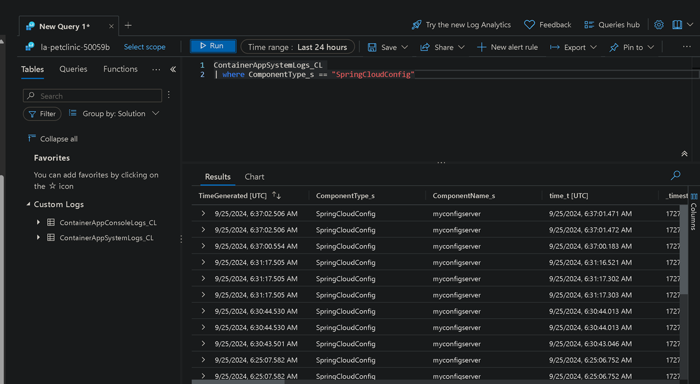
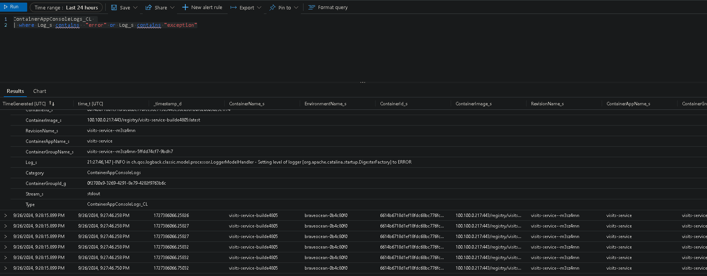

# Enable Log Analytics on your Azure Container Apps environment

Having access to real-time monitoring data for the Container Apps environment is useful, but you’ll also need to record this data and analyze historical activity or events. To support this, you’ll enable [Log Analytics](https://learn.microsoft.com/azure/container-apps/log-monitoring), a feature of Azure Monitor.

Using Log Analytics, your Azure Container Apps environment can record:

- Container console output (for example, stdout or stderr messages).
- System logs generated by the Azure Container Apps environment.
- Azure Springs App console logs.

To learn more about how Log Analytics works with Azure Container Apps, review:

- [Log storage and monitoring options in Azure Container Apps](https://learn.microsoft.com/azure/container-apps/log-options)
- [Create a Log Analytics workspace](https://learn.microsoft.com/azure/azure-monitor/logs/quick-create-workspace?tabs=azure-cli)

## Step-by-step guidance

1.  In your command-line environment, create a new Log Analytics workspace:

    ```bash
    WORKSPACE=la-$APPNAME-$UNIQUEID
    az monitor log-analytics workspace create \
        --resource-group $RESOURCE_GROUP \
        --workspace-name $WORKSPACE
    ```

2.  Enable logging for your Azure Container Apps environment:

    ```bash
    WORKSPACE_ID=$(az monitor log-analytics workspace show -n $WORKSPACE -g $RESOURCE_GROUP --query id -o tsv)
    WORKSPACE_CUSTOMER_ID=$(az monitor log-analytics workspace show -n $WORKSPACE -g $RESOURCE_GROUP --query customerId -o tsv)
    WORKSPACE_KEY=$(az monitor log-analytics workspace get-shared-keys -n $WORKSPACE -g $RESOURCE_GROUP --query primarySharedKey -o tsv)

    az containerapp env update \
        --name $ACA_ENVIRONMENT \
        --resource-group $RESOURCE_GROUP \
        --logs-destination log-analytics \
        --logs-workspace-id $WORKSPACE_CUSTOMER_ID \
        --logs-workspace-key $WORKSPACE_KEY
    ```

3.  Verify that monitoring data is available in your Log Analytics workspace. In your web browser, go to the [Azure portal](http://portal.azure.com/) and then to your Container Apps instance. On the left pane, under Monitoring, select `Logs`.

    From here, you can inspect the monitoring data generated by your app. To review the data in this log table, double-click `ContainerAppConsoleLogs_CL` or `ContainerAppSystemLogs_CL` and then select `Run`.

    From this query screen, you can enter custom [Kusto queries](https://learn.microsoft.com/en-us/kusto/query/?view=microsoft-fabric) and then select `Run`.

    For example, to get a list of all app logs, use the following query:

    ```sql
    ContainerAppConsoleLogs_CL
    ```
    

    To get logs for a specific app, use this query:

    ```sql
    ContainerAppConsoleLogs_CL
    | where ContainerAppName_s == 'your-container-app-name'
    ```

    

    To get logs for the Eureka Server (discovery service), use this query:

    ```sql
    ContainerAppSystemLogs_CL
    | where ComponentType_s == "SpringCloudEureka"
    ```

    

    To get logs for Spring Cloud Config Server, use this query:

    ```sql
    ContainerAppSystemLogs_CL
    | where ComponentType_s == "SpringCloudConfig"
    ```

    

    The following query string returns errors and exceptions thrown by any of your applications:

    ```sql
    ContainerAppConsoleLogs_CL
    | where Log_s contains  "error" or Log_s contains "exception"
    ```

    
