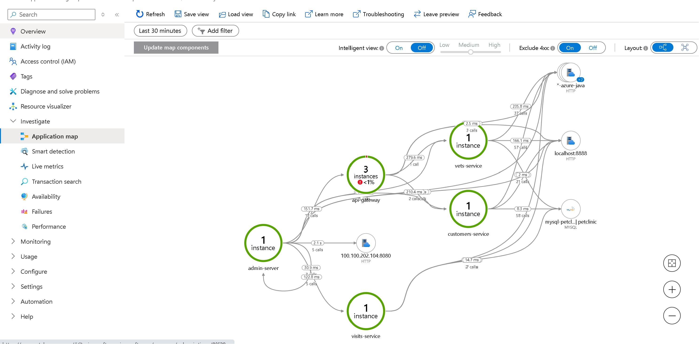
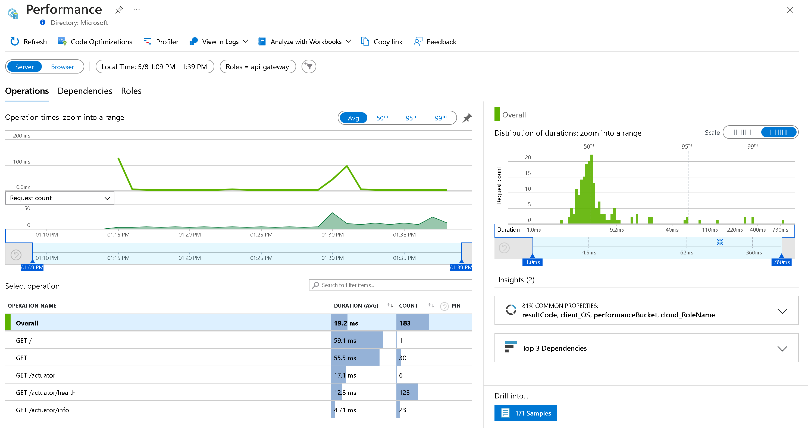
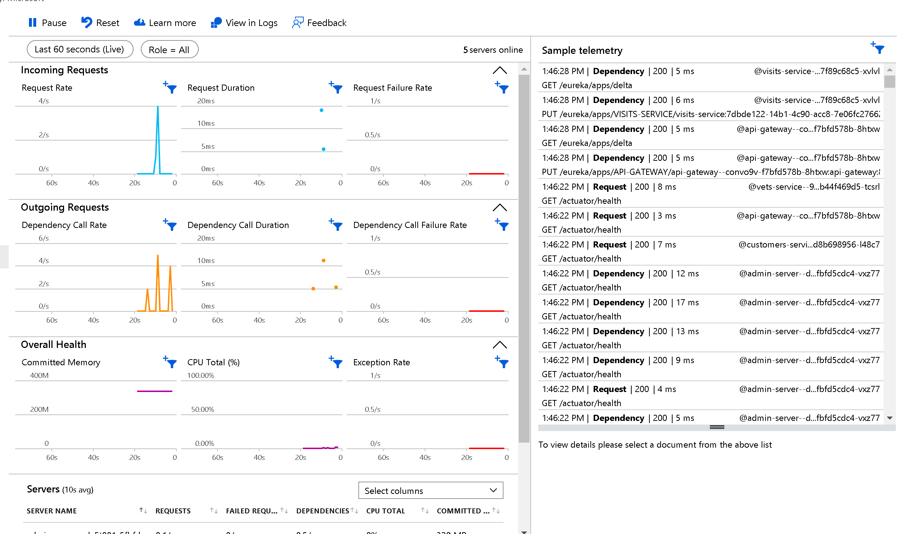
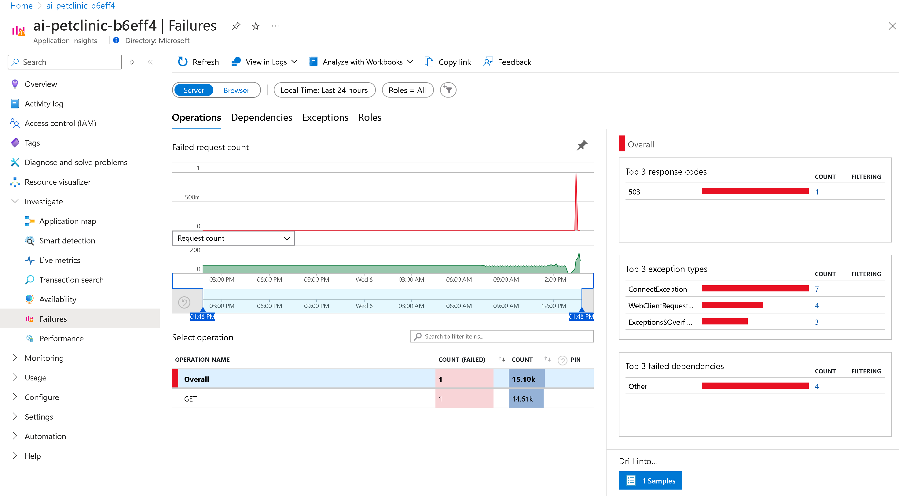
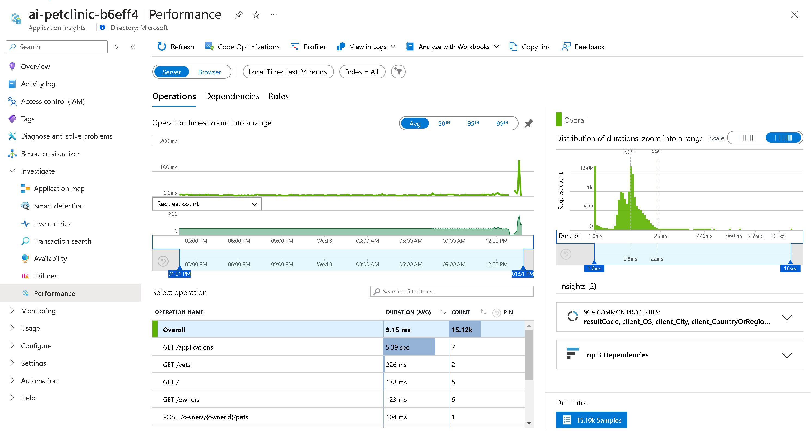

# Analyze application-specific monitoring data

Now that Application Insights is properly configured, you can monitor what’s going on in your application. Using the Azure portal, you’ll be able to access the following information:

- The Application map in Application Insights
- Performance data
- Failures
- Metrics
- Live Metrics
- Availability
- Logs

Before reviewing this information, you’ll need to record some log data. To do this, go to your application, go through the different sub-pages, and refresh each page a couple of times. After waiting for a bit, Application Insights will update with this information from your application.

For more information about the information that Application Insights provides, review the [Application Insights Overview dashboard](https://learn.microsoft.com/azure/azure-monitor/app/overview-dashboard) documentation.

## Step-by-step guidance

1.  In your web browser, go to the [Azure portal](http://portal.azure.com/) and then to the resource group where you deployed your application.
1.  In the resource group, select the Application Insights resource. On the overview page, you can find data about failed requests, server response time, server requests, and availability.

    

1.  Select `Application map`, which provides information about each of the individual applications you're running as part of your overall workload, in addition to their dependencies. This is where the role names you configured earlier when redeploying the applications are used to identify each app.

    

1.  Select `api-gateway`, which offers details about the application, like the slowest requests or failed dependencies.

    

1.  Select `Performance`, which provides more data on the application’s performance.

    

1.  You can also drag your mouse on the graph to select a specific time period, which will then update the view with only data for that period.
1.  Go back to the Application map and select the highlighted api-gateway application.
1.  To see live metrics of your application, select `Live metrics`. This will show you near–real-time performance information for your application, along with the logs and traces coming in.

    

1.  To configure an availability test for your application, select `Availability` and then `Create standard test`.
1. Enter the following details and select `Create`:
    - `Test name:` Enter the name for your test.
    - `URL:` Enter the URL to your api-gateway.
    - Keep all the default settings for the rest of the configuration. Notice that Alerts for this test will be enabled.

        After you create the test, your application will be pinged for availability every five minutes from five separate test locations.

1. On the right of your newly created availability test, select the ellipses and then the Open Rules (Alerts) page.
1. Select the alert rule for your availability test. By default, there are no action groups associated with this alert rule. We won’t configure them in this lab, but for future reference, you should know that with action groups, you can send email or SMS notifications to specific people or groups:

    - [Create and manage action groups in the Azure portal](https://docs.microsoft.com/azure/azure-monitor/alerts/action-groups)

1. Go back to your Application Insights resource.
1. For information on all failures in your applications, select `Failures`. To find more details on them, you can select any of the response codes, exception types, or failed dependencies.

    

1. To review your applications' operations performance data, select `Performance`. This view will be similar to the earlier one.

    

1. To get all logged data, select `Logs`. To search and analyze the logged data, you can use Kusto Query Language (KQL) queries.
    - [Log queries in Azure Monitor](https://docs.microsoft.com/azure/azure-monitor/logs/log-query-overview)
1. Select `Queries` and then `Performance`.
1. To load this query in the query window, double-click `Operations performance`.
1. For the results of this query, select `Run`.

    