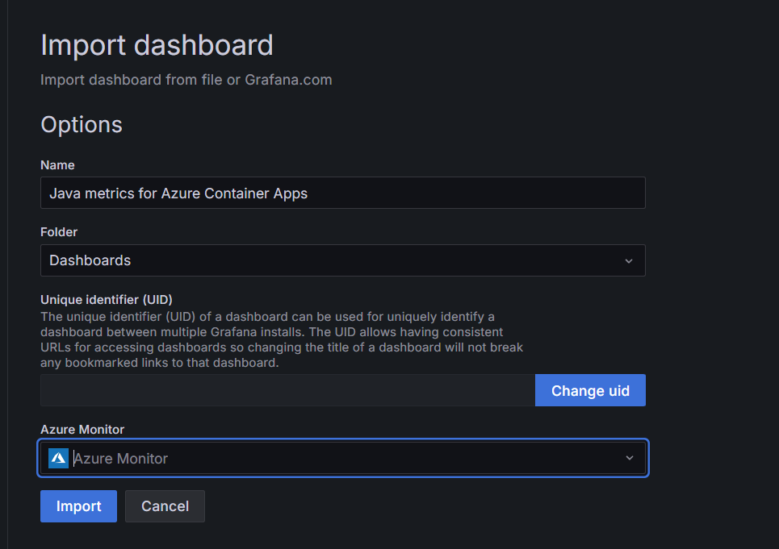
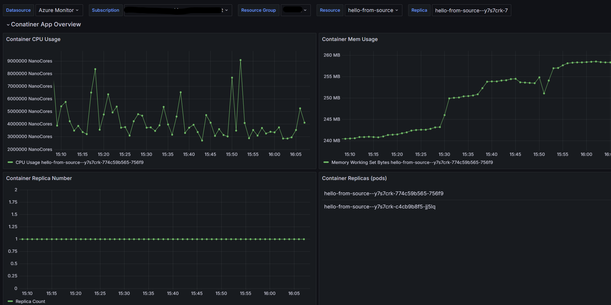
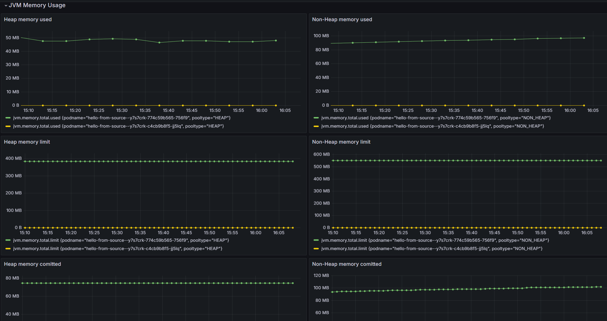
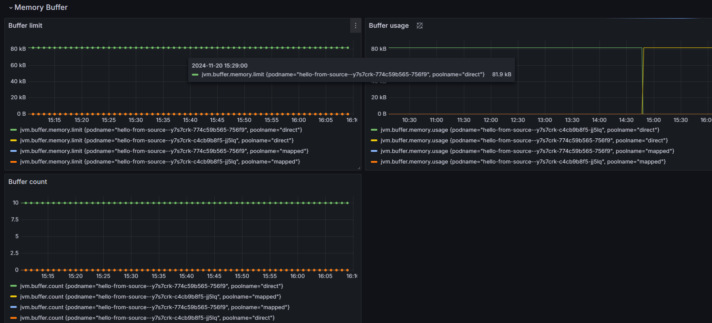
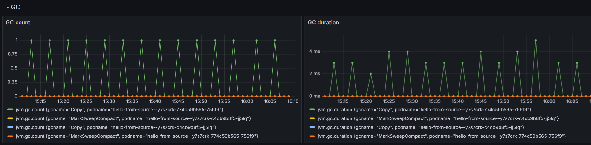
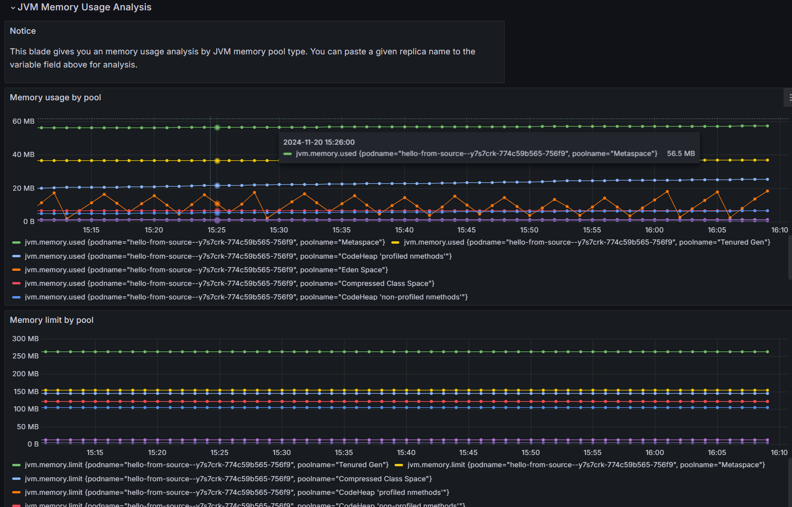

# Build a Java metrics dashboard with Azure Managed Grafana

Grafana is a popular tool for centralized metrics visualization and monitoring. It allows you to ingest data from various sources, query and visualize it through charts and graphs, and create unified dashboards for easier interpretation and understanding.

Azure Managed Grafana is a fully managed Azure service that allows you to deploy and manage Grafana dashboards with seamless Azure integration. To better understand the monitoring data that you’re capturing from your application, you’ll set up a dashboard using this service.

If you’d like to learn more about how Azure Managed Grafana helps visualize exposed Java metrics in Azure Container Apps or how to flow Java metrics to your existing Grafana dashboards, review:

- [Create a dashboard in Azure Managed Grafana](https://learn.microsoft.com/azure/managed-grafana/how-to-create-dashboard)
- [Grafana Labs: Azure Monitor data source](https://grafana.com/docs/grafana/latest/datasources/azure-monitor/)

## Step-by-step guidance

1.  Provision Azure Manage Grafana. In your command-line environment, create an Azure Managed Grafana instance:

    ```bash
    az extension add --name amg --upgrade -y

    GRAFANA_NAME=amg-$UNIQUEID
    az deployment group create \
        --resource-group $RESOURCE_GROUP \
        --template-file ../infra/bicep/modules/grafana/grafana-dashboard.bicep \
        --parameters grafanaName=$GRAFANA_NAME
    ```

1.  Grant yourself the Grafana Admin role. You’ll need this role to manage your Grafana dashboard. Use the following Azure CLI command to add the role assignment:

    ```bash
    GRAFANA_ID=$(az grafana show --resource-group $RESOURCE_GROUP --name $GRAFANA_NAME --query id --output tsv)
    az role assignment create \
        --assignee $AAD_USER_ID \
        --role "Grafana Admin" \
        --scope $GRAFANA_ID
    ```

    {: .note }
    > You can also add the role assignment via the [Azure portal](http://portal.azure.com/). Go to `Access control (IAM)` \> `Add` \> `Add role assignment`.

1.  Import the Java-metrics dashboard. In your command-line environment, run the following command to get the dashboard endpoint URL:

    ```bash
    DASHBOARD_ENDPOINT=$(az grafana show --resource-group $RESOURCE_GROUP --name $GRAFANA_NAME --query "properties.endpoint" --output tsv)
    echo $DASHBOARD_ENDPOINT
    ```

    1. In your browser, go the endpoint URL and sign in with your account.
    1. Go to `Dashboard` \> `New` \> `Import` \> `Import dashboard from file`, and upload the [dashboard/aca-java-metrics-dashboard.json](../../dashboard/aca-java-metrics-dashboard.json) file.
    1. Choose the default built-in `Azure Monitor` as the data source.
    1. Select `Import`.

        

1.  View the Java metrics dashboard with Grafana. Now you can explore all the supported Container Apps Java metrics. Just select your Container Apps resource from the Resource filter.

    The dashboard provides the following live metric data:

    - Container App Overview

      

    - JVM Memory Usage

      

    - JVM Memory Buffer

      

    - JVM Garbage Collection

      

    - JVM Memory Usage Analysis

      

You can use this dashboard as a starting point to create your own customized metric visualizations and monitoring solutions.
