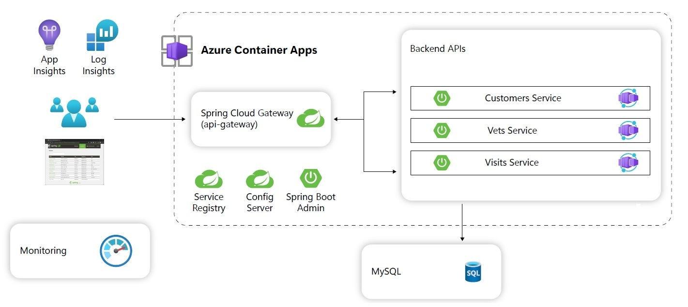

# Review

In this lab, you added monitoring to your Spring Petclinic microservices application to Azure. In this lab you

- Inspected your Azure Container Apps in the Azure Portal
- Configured Azure Container Apps environment monitoring
- Configured Application Insights to receive monitoring information from your applications
- Analyzed application specific monitoring data

The below image illustrates the end state you have build in this lab.

