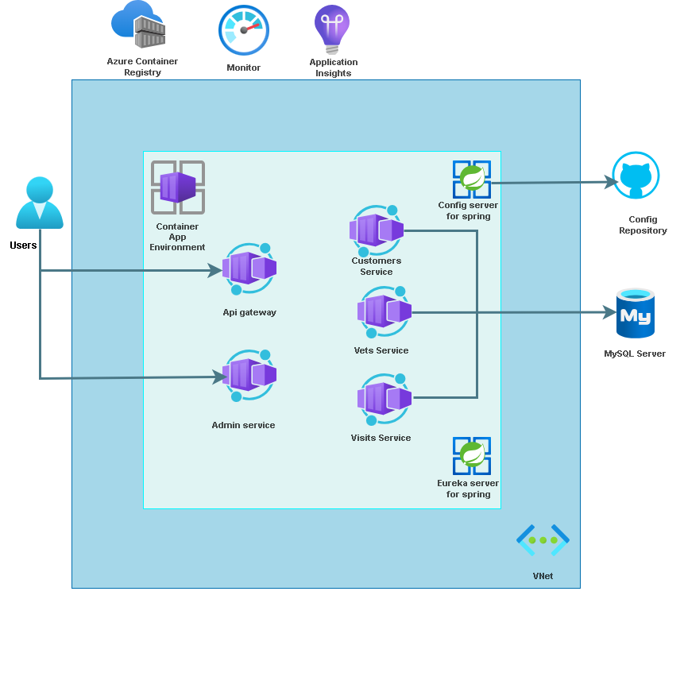

# Review

In this lab, you added monitoring to the example Spring Petclinic Microservices workload that you deployed in the previous lab.

As part of this process, you:

- Inspected your Azure Container Apps in the Azure portal.
- Configured Azure Container Apps environment monitoring.
- Configured Application Insights to receive monitoring information from your applications.
- Analyzed application-specific monitoring data.
- Built a Java metrics dashboard with Azure Managed Grafana.

The following image should now reflect your current application architecture.

