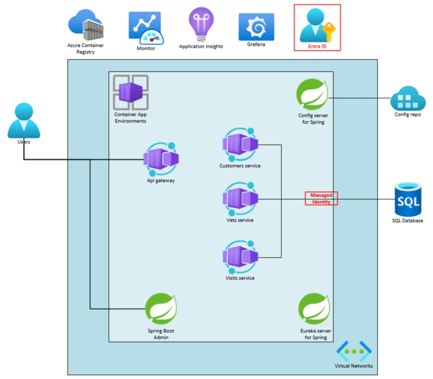

# Lab 04: Connect to a database securely by using managed identity

## Introduction

You now have your copy of the Spring Petclinic Microservices workload running in Azure. However, your applications use secrets, such as your database connection string, which depend on passwords that are stored in your configuration repository.

Passwords are insecure. They can be stolen, guessed, or found via brute force attacks, so protecting your passwords can be a major challenge. You want to find a way to connect to your database without having to deal with this potential vulnerability. 

In this lab, you’ll implement a more secure way to protect your secrets by connecting your applications to your database using managed identities and [Azure Service Connector](https://learn.microsoft.com/azure/service-connector/overview). This approach allows you to implement secure passwordless connectivity without modifying your application code, giving you  a ["zero code, zero secrets, and zero trust"](https://learn.microsoft.com/azure/developer/intro/passwordless-overview) solution. 

## What you’ll cover

As you work through this lab, you’ll learn how to:

-   Create a database administrator account.
-   Update the application dependencies to enable passwordless connectivity.
-   Create service connections from your applications to the database server.

The following diagram illustrates how your application’s architecture should look after you’ve completed this lab.

## Duration

**Estimated time:** 30 minutes

{: .note }
> This lab assumes that you successfully completed the previous lab and are using the same lab environment, including your command-line session, with the relevant environment variables already set.
