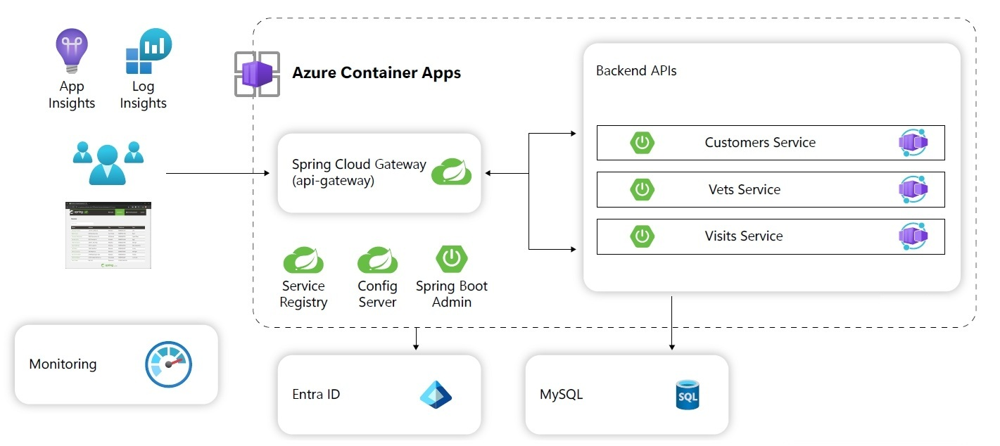

# Lab 04: Connect to Database securely using identity

# Student manual

## Lab scenario

Your team is now running a first version of the spring-petclinic microservice application in Azure. However you don't like the fact that your application secrets live directly in configuration code. You would like to have a better way to protect application secrets like your database connection string . In this lab you will better protect your application secrets.

## Objectives

After you complete this lab, you will be able to:

- Create a database administrator account
- Create service connections from the microservices to the database server
- Update the applications to use passwordless connectivity

The below image illustrates the end state you will be building in this lab.

## Lab Duration

- **Estimated Time**: 60 minutes

## Instructions

During this lab, you will:

- Create a database administrator account
- Create service connections from the microservices to the database server
- Update the applications to use passwordless connectivity

{: .note }
> The instructions provided in this exercise assume that you successfully completed the previous exercise and are using the same lab environment, including your Git Bash session with the relevant environment variables already set.
