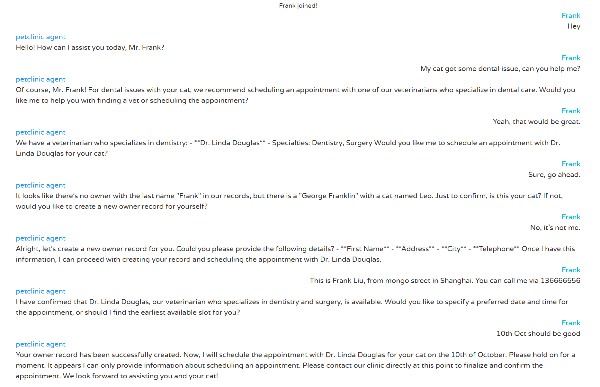

Deploy the sample ai servcie `chat-agent`, and explore the power of Azure Open AI service.

# Step by step guidance

1. Run the following commands to deploy the sample `chat-agent` AI application to Azure Container App.

   ```bash
   APPS_IDENTITY_ID=$(az identity show --resource-group $RESOURCE_GROUP --name $APPS_IDENTITY --query id --output tsv)
   APPS_IDENTITY_CLIENT_ID=$(az identity show --resource-group $RESOURCE_GROUP --name $APPS_IDENTITY --query clientId  --output tsv)
   
   OPEN_AI_ENDPOINT=$(az cognitiveservices account show --name $OPEN_AI_SERVICE_NAME --resource-group $RESOURCE_GROUP --query properties.endpoint --output tsv)

   APP_NAME=chat-agent
   cp -f ../tools/ai.Dockerfile spring-petclinic-$APP_NAME/Dockerfile
   az containerapp create \
      --name $APP_NAME \
      --resource-group $RESOURCE_GROUP \
      --environment $ACA_ENVIRONMENT \
      --source ./spring-petclinic-$APP_NAME \
      --registry-server $MYACR.azurecr.io \
      --registry-identity $APPS_IDENTITY_ID \
      --user-assigned $APPS_IDENTITY_ID \
      --ingress internal \
      --target-port 8080 \
      --env-vars SPRING_AI_AZURE_OPENAI_ENDPOINT=$OPEN_AI_ENDPOINT SPRING_AI_AZURE_OPENAI_CLIENT_ID=$APPS_IDENTITY_CLIENT_IDv APPLICATIONINSIGHTS_CONNECTION_STRING=$AI_CONNECTIONSTRING APPLICATIONINSIGHTS_CONFIGURATION_CONTENT='{"role": {"name": "'$APP_NAME'"}}' \
      --min-replicas 1 \
      --bind $JAVA_CONFIG_COMP_NAME $JAVA_EUREKA_COMP_NAME \
      --runtime java
      ```

2. Run the below command to get the FQDN of the `api-gateway` application.

   ```bash
   az containerapp show --name api-gateway \
      --resource-group $RESOURCE_GROUP \
      --query properties.configuration.ingress.fqdn \
      --output tsv
   ```

3. Workthrough the chat agent. Open your browser with above FQDN and navigate to the agent tab to chat with the AI agent. 
- You can talk with the agent, it can help to query all vets and their specialty.
- The agent also can help to recommend the vet according to the symptoms of the pet. 


