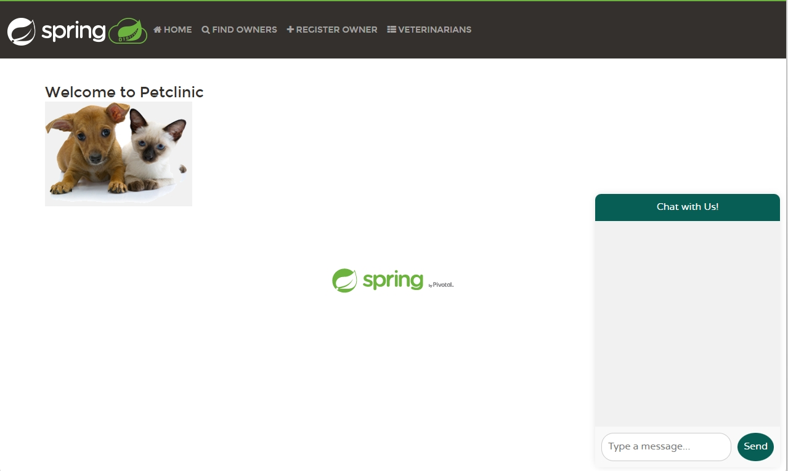
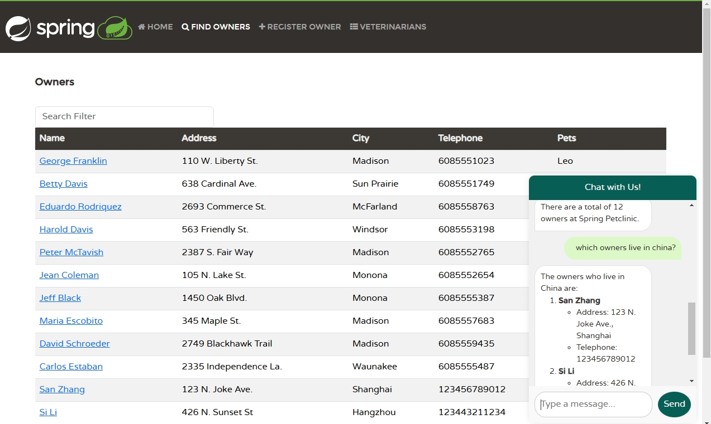

# Improve the chat service experience (optional)

You’ve completed this lab’s step-by-step instructions and built a chatbot that integrates with the Sprint Petclinic application. The following optional sections can extend the chat service’s capabilities and improve how users interact with it.

## Update the api-gateway service to add a new chat window

Currently, you have a chatbot service running in your Spring Petclinic application, but the only way to interact with it is using the `curl` command to manually make HTTP requests.

In this section, we’re going to implement a more user-friendly way to talk to the chat service using the `api-gateway` dashboard.

Use the following steps to add a new chat box to the Petclinic dashboard. (This may take approximately 10 minutes to complete.)

1.  Add a new route entry for `chat-service`. Note that this name will be used later.

    Open the `spring-petclinic-api-gateway/src/main/resources/application.yml` file, and append a new entry:

    ```yml
            - id: chat-service
            uri: lb://chat-service
            predicates:
                - Path=/api/chat/**
            filters:
                - StripPrefix=2
    ```

1.  Apply the Git patch file `api-gateway-chatbox.patch` found in the sample repo’s `tools` folder. This adds code to the `api-gateway` project that implements the chat box feature we’ll use to interact with the chat service.

    ```bash
    git apply ../tools/api-gateway-chatbox.patch
    ```

    {: .note }
    > This patch is not guaranteed to work in all versions.

1.  In the command-line window, rebuild the `api-gateway` project and update the container app.

    ```bash
    APP_NAME=api-gateway
    mvn clean package -DskipTests -pl spring-petclinic-$APP_NAME
    az containerapp update --name $APP_NAME --resource-group $RESOURCE_GROUP \
    --source ./spring-petclinic-$APP_NAME
    ```

1.  Validate that the new chat box is working.

    First, use the following command to get the URL of the api-gateway:

    ```bash
    api_gateway_FQDN=$(az containerapp show \
    --resource-group $RESOURCE_GROUP \
    --name $APP_NAME \
    --query properties.configuration.ingress.fqdn \
        -o tsv)

    echo https://$api_gateway_FQDN
    ```
    Open the api-gateway URL in your browser. You should find a chat box in the lower-right corner.

    

    Use the chat box to ask the AI some questions about the Petclinic app to verify that it’s working:

    

## Enhance the AI model by adding more function callbacks

Currently, the chatbot is only capable of answering questions about pet owners. However, you can enhance the AI chatbot by adding more functions—for example, `add new owners`, `add pets`, and similar tasks. If you have time, try implementing these service functions and configure the chat client using the same `FunctionCallback` mechanism that you used in the previous section.