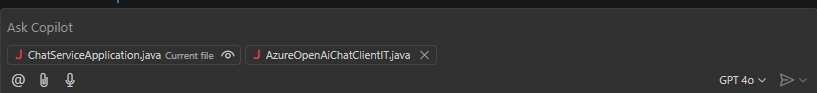
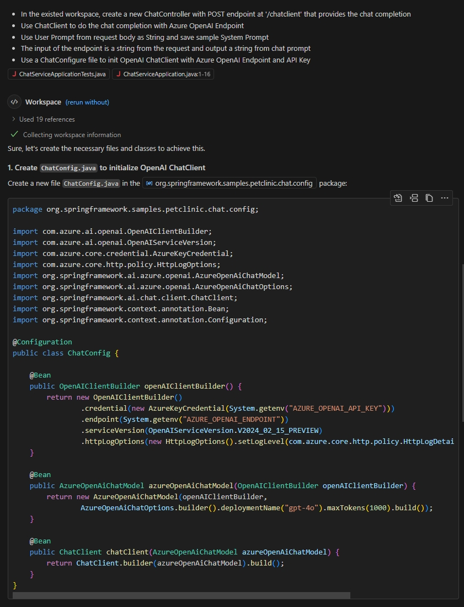
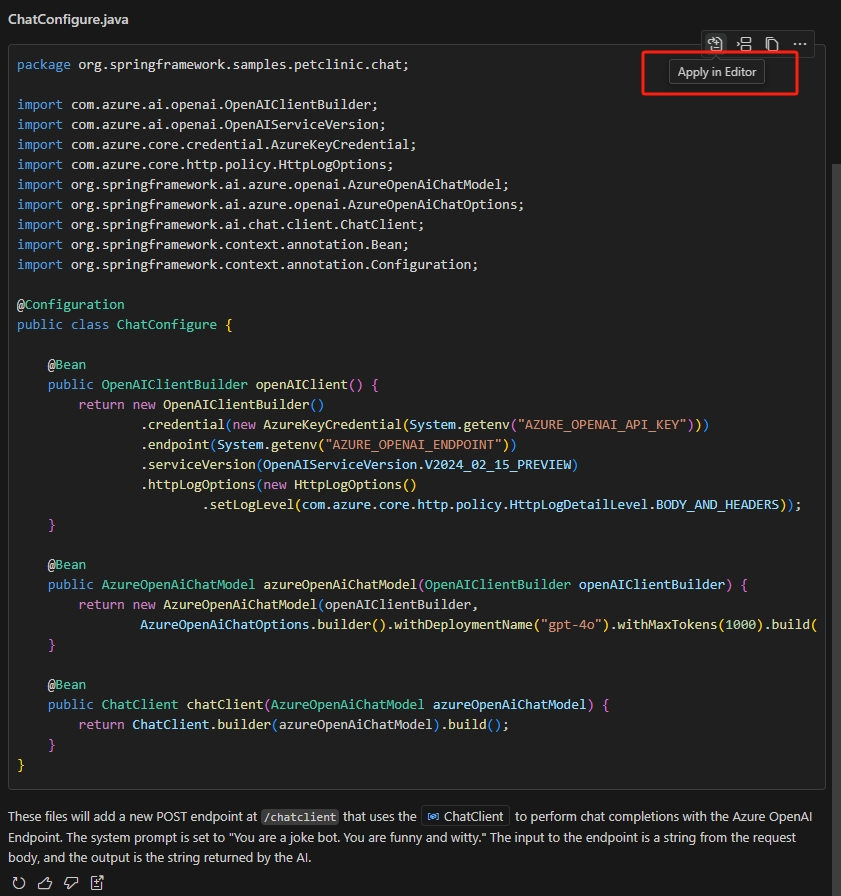
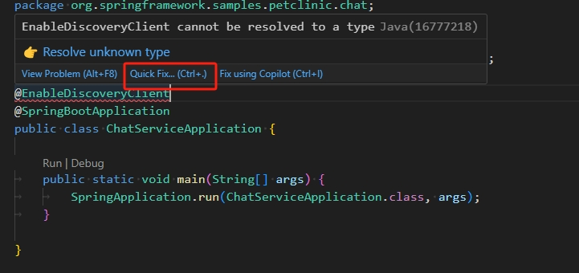
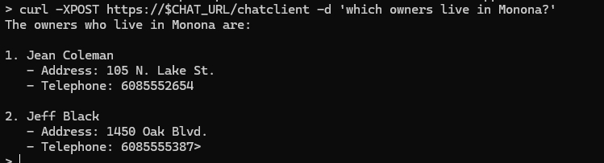

# Create an AI application from scratch for the Petclinic workload

In this section, you’ll learn how to create an AI-enabled Java application using Azure OpenAI and Spring AI. You’ll then configure this application to answer questions about the sample Spring Petclinic Microservices application that you’ve deployed and configured in previous labs.

You’ll start by creating a new Spring Boot service application that connects with your Azure OpenAI instance. Then you'll use this application to implement a simple chatbot that takes advantage of the Azure OpenAI GPT-4o model, learning how to seamlessly integrate AI into your existing Spring Petclinic Microservices application as you go.

## Prerequisites:

-   A GitHub Copilot subscription. (If you don’t already have a subscription, try [GitHub Copilot Free](https://docs.github.com/en/copilot/quickstart#sign-up-for-github-copilot).)
-   The [GitHub Copilot Chat extension](https://marketplace.visualstudio.com/items?itemName=GitHub.copilot-chat) installed in your copy of Visual Studio Code.
-   A prepared Azure OpenAI instance with the `gpt-4o` model deployed. For more details, refer to the instructions [in previous section of this lab]().
-   The `endpoint` and `api-key` values for your Azure OpenAI instance. You can find these by going to your Azure OpenAI instance in the Azure portal and looking in the `Resource Management` \> `Keys and Endpoint` section.

## Step by step guidance

### Create a new Spring Boot application

Your first step in this process is to create a new Spring Boot application:

1. Use the [spring initializr](https://start.spring.io/) tool to create a new Spring Boot application. When you create the new application, you’ll need to specify the following dependencies:

    - **Spring Web** (`web`). Supports the base Spring Boot app functionality.
    - **Eureka Discovery Client** (`cloud-eureka`). Supports locating other component applications within overall workload.
    - **Spring Boot Actuator** (`actuator`). Supports endpoints that help monitor and manage your application.
    - **Lombok** (`lombok`). A Java annotation library, which helps to reduce boilerplate code.
    - **Azure OpenAI** (`spring-ai-azure-openai`). Spring AI support for Azure OpenAI.

    You’ll also need to provide additional settings, such as project type, Java code details, and naming to match the structure of the existing Spring Petclinic Microservices application.

    To create the new Spring Boot  application using these settings, in your command-line window, go to the `src` folder of your local code repo and run the following command:

    ```bash
    mkdir spring-petclinic-chat-service

    curl https://start.spring.io/starter.tgz \
        -d dependencies=web,cloud-eureka,actuator,lombok,spring-ai-azure-openai \
        -d name=chat-service -d type=maven-project \
        -d jvmVersion=17 -d language=java -d packaging=jar \
        -d groupId=org.springframework.samples.petclinic -d artifactId=chat \
        -d description="Spring Petclinic Chat Service" \
        | tar -xzvf - -C spring-petclinic-chat-service
    ```

1.  Open the newly created application folder in Visual Studio Code.

    ```bash
    code spring-petclinic-chat-service
    ```

1.  In Visual Studio Code, open the `pom.xml` file and find the `spring-ai.version` value for the project.

    ```xml
    <spring-ai.version>1.0.0-M5</spring-ai.version>
    ```

1.  In your command-line window, save this version number as an environment variable for later use (modifying the version number to match the value you see in your actual `pom.xml` file).

    ```bash
    SPRING_AI_VERSION=1.0.0-M5
    ```

### Generate AI code using Github Copilot

GitHub Copilot is a specially trained language model that you can use to generate code snippets. However, since the Spring AI project that you’ll be using to interact with Azure OpenAI is relatively new, Copilot may not have the context and data required to create Spring AI code. To overcome this potential limitation, you can use [prompt engineering](https://learn.microsoft.com/en-us/azure/ai-services/openai/concepts/prompt-engineering?tabs=chat) to provide the contextual information that Copilot needs.

To do this, you’ll download a version-appropriate example code file from the Spring AI project and then submit it as a part of your Copilot code generation prompt.

1.  Download the version-appropriate Spring AI chat client sample code to your local environment.

    In your command-line window, go to the directory `spring-petclinic-microservices` and run the following commands:

    ```bash
    TEST_FILE="https://raw.githubusercontent.com/spring-projects/spring-ai/refs/heads/${SPRING_AI_VERSION}/models/spring-ai-azure-openai/src/test/java/org/springframework/ai/azure/openai/AzureOpenAiChatClientIT.java"
    wget $TEST_FILE -P spring-petclinic-chat-service/src/main/resources/
    ```

1.  In Visual Studio Code, open the `Github Copilot Chat` window and select the `ChatServiceApplication.java` file. The file name appears in the "Ask Copilot" input box as "Current file context".

1.  Drag the file `src/main/resources/AzureOpenAiChatClientIT.java` to the "Ask Copilot" window. Note that the file name appears in the "Ask Copilot" input box.

    

1.  Enter the following text in the “Ask Copilot” input box:

    ```text
    You are a Java engineer who wants to write your first AI empowered service and you’re going to start a new project from some samples.
    Refer to the sample file named "AzureOpenAIChatClientIT.java", add a new ChatController class with POST endpoint at '/chatclient' to the chat-service project:
    * Use ChatClient to do the chat completion with Azure OpenAI Endpoint
    * Use the system prompt from this static string: "You are a joke bot. You are funny and witty."
    * The input of the endpoint '/chatclient' is a string from the request, and the output is a string returned by AI.
    * Use a configure file "ChatConfigure.java" file to init OpenAI ChatClient with Azure OpenAI Endpoint and API Key.
    ```

    You’ll notice a screen that looks like this:

    

    Follow the steps to make changes to your project. To apply the AI-generated code, select **Apply in Editor**. For details, refer to the following screenshot.

    

    {: .note }
    > The AI-generated code may not always be the same and is sometimes incorrect. If you run into errors, try repeating these steps to regenerate it.


### Build and run your new AI application

Now that your project is updated with the Copilot-generated code, you’re ready to build the new application and test it in your local development environment.

1.  In your Visual Studio Code terminal, build the new AI project.

    ```bash
    mvn clean package -DskipTests
    ```

    Review the code generated by GitHub Copilot. For more information on configuration properties, refer to [Azure OpenAI chat properties](https://docs.spring.io/spring-ai/reference/api/chat/azure-openai-chat.html).
    
    {: .note }
    > You might need to implement some minor fixes in the AI-generated code. The most common fix involves modifying the following line in the ChatController.java file: `response.getResults().get(0).getOutput().getText()` --> `response.getResults().get(0).getOutput().getContent()`

1.  Now you'll run the new project locally.

    After a successful build, use your Visual Studio Code terminal to run the project.

    ```bash
    export AZURE_OPENAI_API_KEY="<AZURE-OPENAI-API-KEY>"
    export AZURE_OPENAI_ENDPOINT="<AZURE-OPENAI-ENDPOINT>"

    mvn spring-boot:run
    ```

1.  In another command-line window, verify that the application is running by making the following call:

    ```bash
    curl -XPOST http://localhost:8080/chatclient -d 'tell a joke'
    ```

  You now have a functioning AI-powered joke bot!


### Deploy your new `chat-service` to your Container Apps environment

With your `chat-service` app built and working, you’re ready to deploy it to your Container Apps environment alongside the other components of the Spring Petclinic Microservices application.

1.  In your command-line environment, run the following command to deploy the app:

    ```bash
    APP_NAME=chat-service

    AZURE_OPENAI_API_KEY="<AZURE-OPENAI-API-KEY>"
    AZURE_OPENAI_ENDPOINT="<AZURE-OPENAI-ENDPOINT>"

    cp -f ../tools/Dockerfile ./spring-petclinic-$APP_NAME/Dockerfile
    az containerapp create \
        --name $APP_NAME \
        --resource-group $RESOURCE_GROUP \
        --environment $ACA_ENVIRONMENT \
        --source ./spring-petclinic-$APP_NAME \
        --registry-server $MYACR.azurecr.io \
        --registry-identity $APPS_IDENTITY_ID \
        --ingress external \
        --target-port 8080 \
        --min-replicas 1 \
        --env-vars AZURE_OPENAI_API_KEY="$AZURE_OPENAI_API_KEY" AZURE_OPENAI_ENDPOINT="$AZURE_OPENAI_ENDPOINT" \
        --bind $JAVA_EUREKA_COMP_NAME \
        --runtime java
    ```

1.  Get the endpoint of the newly deployed chat service application.

    ```bash
    CHAT_URL=$(az containerapp show \
      --resource-group $RESOURCE_GROUP \
      --name $APP_NAME \
      --query properties.configuration.ingress.fqdn \
      -o tsv)
    ```

1.  Verify that the endpoint is working by using curl.

    ```bash
    curl -XPOST https://$CHAT_URL/chatclient -d 'Hi, tell a joke'
    ```

  Congratulations, your joke bot is running on Azure Container Apps!

### Empower your AI service to support the Petclinic project

Getting this initial joke bot deployed is a good first step in understanding how to use Azure OpenAI within Spring applications. However, to make it useful for the Petclinic application, you’ll have to make some changes to how the bot works.

1.  First you’ll enable the discovery client so that the chat service can find other application components of the Spring Petclinic workload.

    Open the `ChatServiceApplication.java` file in the AI chat project, and add the `@EnableDiscoveryClient` annotation to the `ChatServiceApplication` class. This enables the new chat service to find other registered services.

    To update the code and fix any alerts, use the Visual Studio Code hint feature, as shown in the following screenshot.

     

1.  Next, update the system prompt to tell the AI service application to help Petclinic app users.

    In the `ChatController.java` file, replace the system prompt with the following statement:

    ```java
    private static final String SYSTEM_PROMPT = """
              You are a friendly AI assistant designed to help with the management of a veterinarian pet clinic called Spring Petclinic.
              Your job is to answer questions about and to perform actions on the user's behalf, mainly around veterinarians, owners, owners' pets and owners' visits.
              You are required to answer in a professional manner. If you don't know the answer, politely tell the user you don't know the answer, then ask the user a follow-up question to try and clarify the question they are asking.
              If you do know the answer, provide the answer but do not provide any additional follow-up questions.
              When dealing with vets, if the user is unsure about the returned results, explain that there may be additional data that was not returned.
              Only if the user is asking about the total number of all vets, answer that there are a lot and ask for some additional criteria.
              For owners, pets or visits - provide the correct data.
          """;
    ```

1.  Now, you'll extend the functionality of the bot by implementing Spring AI function calling.

    To do this, you’ll implement a basic [Retrieval-Augmented Generation (RAG)](https://learn.microsoft.com/en-us/azure/search/retrieval-augmented-generation-overview) pattern using Spring AI. This pattern is an industry-standard approach to building language model–based applications which use specific or proprietary data that is not already known to an AI model. You’ll need to use this method to help Azure OpenAI interact with the Petclinic application and provide relevant responses using Petclinic data.

    For more information about how Spring AI supports these capabilities, refer to the [Spring AI FunctionCallback API](https://docs.spring.io/spring-ai/reference/1.0/api/function-callback.html) documentation.

    {: .note }
    > The Spring AI API is under development and the interface may change over time. In this sample, we’re using the `$SPRING_AI_VERSION` API version.

    In the following steps, you’ll implement a FunctionCallback interface which allows the AI to get pet owner information that’s stored in your existing Spring Petclinic application.

    - Create a new folder named `model` and add a class `Owner` in that folder for owner details.

        ```java
        package org.springframework.samples.petclinic.chat.model;

        import lombok.Data;

        import java.io.Serializable;

        @Data
        public class Owner implements Serializable {

          private Integer id;

          private String firstName;

          private String lastName;

          private String address;

          private String city;

          private String telephone;
        }
        ```

    - Create a new folder named `services`, and create the class `OwnerService` in that folder to retrieve owner info from `api-gateway`.

        ```java
        package org.springframework.samples.petclinic.chat.services;

        import java.util.List;

        import org.springframework.core.ParameterizedTypeReference;
        import org.springframework.http.HttpMethod;
        import org.springframework.samples.petclinic.chat.model.Owner;
        import org.springframework.stereotype.Service;
        import org.springframework.web.client.RestTemplate;

        @Service
        public class OwnerService {

          public List<Owner> getOwners() {

              RestTemplate restTemplate = new RestTemplate();
              var responseEntity = restTemplate.exchange(
                      "http://api-gateway/api/customer/owners",
                      HttpMethod.GET,
                      null,
                      new ParameterizedTypeReference<List<Owner>>() {
                      });

              List<Owner> owners = responseEntity.getBody();
              return owners;
          }
        }
        ```

1.  Add the necessary FunctionCallback code to the chat client.

    First, add the following attribute to the `ChatController` class:

    ```java
    @Autowired
    private OwnerService ownerService;
    ```

    Add the new FunctionCallback to the chat client. The new code segment would like, see the `functions` part.

    ```java
            ChatResponse response = this.chatClient.prompt()
              .system(systemPrompt)
              .user(userPrompt)
              .functions(FunctionCallback.builder()
                      .description("list all owners")
                      .method("getOwners")
                      .targetObject(ownerService)
                      .build())
              .call()
              .chatResponse();
    ```

    Fix any remaining `import` issues with the help of the Visual Studio Code hint feature.

1.  Rebuild the project in your Visual Studio Code terminal window.

    ```bash
    mvn clean package -DskipTests
    ```

1.  Update the chat service application by using the following command:

    ```bash
    az containerapp update --name $APP_NAME --resource-group $RESOURCE_GROUP \
        --source ./spring-petclinic-$APP_NAME
    ```

1.  Verify the new RAG-empowered AI bot by asking it a question about owner information.

    ```bash
    curl -XPOST https://$CHAT_URL/chatclient -d 'which owners live in Monona?'
    ```
     


Congratulations! You now have a chatbot that can answer questions specifically about the Spring Petclinic application. This is a good example of how easy it is to integrate the capabilities of Azure OpenAI with your existing services and applications.
