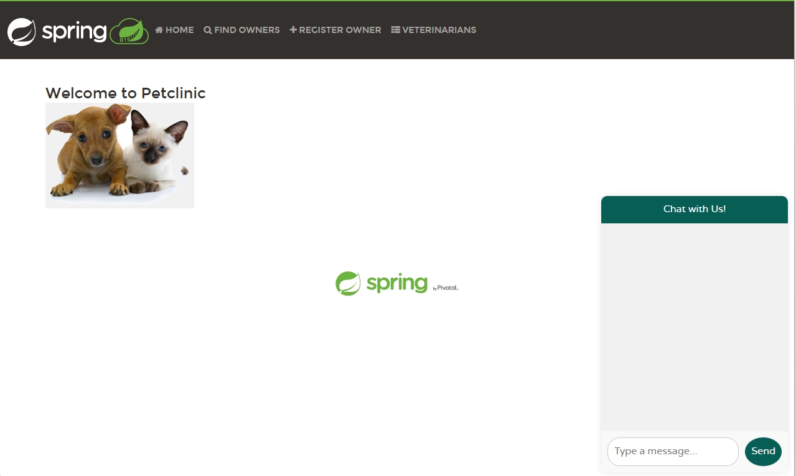

# Create AI application from scratch on petclinic services

In this chapter, we will learn how to create AI Java applications using Azure OpenAI and Spring AI, and empower AI to answer questions related to the the petclinic services.

We will start by creating a new Spring Boot application to connect with Azure OpenAI. Then we'll implement a simple chatbot using Azure OpenAI's GPT-4o model to demonstrate seamless AI integration into the existing petclinic Java applications.

Prerequisites:

- Install extension `Github Copilot Chat` in VSCode, try [Github Copilot Free](https://docs.github.com/en/copilot/managing-copilot/managing-copilot-as-an-individual-subscriber/about-github-copilot-free#vs-code).
- Prepare the Open AI instance and install deployment `gpt-4o`, see [guide]().
- Get the `endpoint` and `api-key` from the Open AI instance.

# Step by step guide

1. Create a new spring boot application

   We create a new spring boot application from [spring initializr](https://start.spring.io/). First we need a `Web` base spring boot application. And this is an AI application so we add the dependency `Azure OpenAI`. To running and monitoring well in Azure Container Apps, we add some dependencies like `Spring Boot Actuator` and `Eureka Discovery Client`.

   Fill the other variables according to the structure of the existing petclinic microservices. Use the command below to create the new service:

   ```bash
   mkdir spring-petclinic-chat-service

   curl https://start.spring.io/starter.tgz \
       -d dependencies=web,cloud-eureka,actuator,lombok,spring-ai-azure-openai \
       -d name=chat-service -d type=maven-project \
       -d jvmVersion=17 -d language=java -d packaging=jar \
       -d groupId=org.springframework.samples.petclinic -d artifactId=chat \
       -d description="Spring Petclinic Chat Service" \
       | tar -xzvf - -C spring-petclinic-chat-service
   ```

   We may open the new application in VSCode to next operations.

   ```bash
   code spring-petclinic-chat-service
   ```

   Edit with VSCode will accelerate your work in the next steps.

   Get the `spring-ai` version from the file `pom.xml` in the project.

   ```xml
   <spring-ai.version>1.0.0-M5</spring-ai.version>
   ```

   Here the spring-ai version is `1.0.0-M5`, save it as variable in your command-line window:

   ```bash
   SPRING_AI_VERSION=1.0.0-M5
   ```

1. Generate the first AI code

   GitHub Copilot is a specially trained LLM model that can generate code snippets based on the context. As Spring AI is very new project and the LLM model may not have the latest knowledge about Spring AI. To overcome this limitation, we can use the prompt engineering to provide the context to Copilot.

   Here we use the versioned test code from Spring AI as part of the prompt. Download the chat client sample matching the spring-ai version to your local environment.

   In your command line window (current directory spring-petclinic-microservices), run commands:

   ```bash
   TEST_FILE="https://raw.githubusercontent.com/spring-projects/spring-ai/refs/heads/${SPRING_AI_VERSION}/models/spring-ai-azure-openai/src/test/java/org/springframework/ai/azure/openai/AzureOpenAiChatClientIT.java"
   wget $TEST_FILE -P spring-petclinic-chat-service/src/main/resources/
   ```

   In your VSCode IDE, open the `Github Copilot Chat` window, click file `ChatServiceApplication.java`, you will see the file name show in the "Ask Copilot" input box as "Current file context".

   Drag the file `src/main/resources/AzureOpenAiChatClientIT.java` to the "Ask Copilot" window, note the file name will show in the "Ask Copilot" input box.

   

   Input the following text to the input box:

   ```text
   You are a java engineer want to write your first AI empowered service and you start the new project from some samples.
   Refer to the sample file named "AzureOpenAIChatClientIT.java", add a new ChatController with POST endpoint at '/chatclient' to the chat-service project:
   * Use ChatClient to do the chat completion with Azure OpenAI Endpoint
   * Use system prompt from static string "You are a joke bot. You are funny and witty."
   * The input of the endpoint '/chatclient' is a string from the request, and the output is a string returned by AI.
   * Use a configure file "ChatConfigure.java" file to init OpenAI ChatClient with Azure OpenAI Endpoint and API Key.
   ```

   You will see screen like this:

   

   

   Follow the steps to make changes to your project. Click "Apply in Editor" to apply the AI generated code. See the screenshot above.

   {: .note }
   The AI generated code may differs from time to time, sometimes it is not correct.

1. Build and run your first AI application.

   - In your VSCode terminal, build the new AI project.

     ```bash
     mvn clean package -DskipTests
     ```

     Read the code generated by Github Copilot. Refer to [Azure OpenAI chat properties](https://docs.spring.io/spring-ai/reference/api/chat/azure-openai-chat.html) for more info on configuration properties.

     - Fix some potential errors. You might need some minor fixes in the AI generated code. Some of the fixes including:

       a. In ChatController.java: `response.getResults().get(0).getOutput().getText()` --> `response.getResults().get(0).getOutput().getContent()`

   - Run the new project locally:

     After a success build, run the project in your VSCode terminal:

     ```bash
     export AZURE_OPENAI_API_KEY="<AZURE-OPENAI-API-KEY>"
     export AZURE_OPENAI_ENDPOINT="<AZURE-OPENAI-ENDPOINT>"

     mvn spring-boot:run
     ```

     In another command line window, verifty the service with

     ```bash
     curl -XPOST http://localhost:8080/chatclient -d 'tell a joke'
     ```

     Now we have a AI empowered joke bot!

1. Deploy the `chat-service` to your Container Apps Environment.

   In your commandline environment, run:

   ```bash
   APP_NAME=chat-service

   AZURE_OPENAI_API_KEY="<AZURE-OPENAI-API-KEY>"
   AZURE_OPENAI_ENDPOINT="<AZURE-OPENAI-ENDPOINT>"

   cp -f ../tools/Dockerfile ./spring-petclinic-$APP_NAME/Dockerfile
   az containerapp create \
       --name $APP_NAME \
       --resource-group $RESOURCE_GROUP \
       --environment $ACA_ENVIRONMENT \
       --source ./spring-petclinic-$APP_NAME \
       --registry-server $MYACR.azurecr.io \
       --registry-identity $APPS_IDENTITY_ID \
       --ingress external \
       --target-port 8080 \
       --min-replicas 1 \
       --env-vars AZURE_OPENAI_API_KEY="$AZURE_OPENAI_API_KEY" AZURE_OPENAI_ENDPOINT="$AZURE_OPENAI_ENDPOINT" \
       --bind $JAVA_EUREKA_COMP_NAME \
       --runtime java
   ```

   Get the endpoint of the chat-service:

   ```bash
   CHAT_URL=$(az containerapp show \
      --resource-group $RESOURCE_GROUP \
      --name $APP_NAME \
      --query properties.configuration.ingress.fqdn \
      -o tsv)
   ```

   And verify with curl:

   ```bash
   curl -XPOST https://$CHAT_URL/chatclient -d 'Hi, tell a joke'
   ```

   Congratulations, your get a joke bot running on Azure Container Apps!

1. Empower AI to petclinic project.

   The first joke bot is not what we want for the petclinic project, some changes required to the new AI project.

   - Enable DiscorveryClient, so the chat service can visit the other services in petclinic.

     Open file `ChatServiceApplication.java` in the new project, add `@EnableDiscoveryClient` annotation to the class `ChatServiceApplication`. This will enable the new chat-service visiting the other service via registered services.

     Update code and fix the alert via VSCode hint like below.

     

   - Update the system prompt.

     In `ChatController.java`, replace the system prompt with the statement below:

     ```java
     private static final String SYSTEM_PROMPT = """
               You are a friendly AI assistant designed to help with the management of a veterinarian pet clinic called Spring Petclinic.
               Your job is to answer questions about and to perform actions on the user's behalf, mainly around veterinarians, owners, owners' pets and owners' visits.
               You are required to answer an a professional manner. If you don't know the answer, politely tell the user you don't know the answer, then ask the user a followup question to try and clarify the question they are asking.
               If you do know the answer, provide the answer but do not provide any additional followup questions.
               When dealing with vets, if the user is unsure about the returned results, explain that there may be additional data that was not returned.
               Only if the user is asking about the total number of all vets, answer that there are a lot and ask for some additional criteria.
               For owners, pets or visits - provide the correct data.
            """;
     ```

   - Function Calling with SpringAI

     In this section, we will implement a basic RAG (Retrieval-Augmented Generation) pattern using Spring AI. The Retrieval-Augmented Generation (RAG) pattern is an industry standard approach to building applications that use large language models to reason over specific or proprietary data that is not already known to the large language model. This is critical because Azure Open AI model that we integrated in the previous step don't know anything about the PetClinic application.

     Refer to [Spring AI FunctionCallback API](https://docs.spring.io/spring-ai/reference/1.0/api/function-callback.html) for more information.

     {: .note }
     The Spring AI API is under development and the interface may change time to time. At this moment, we are using the API version `$SPRING_AI_VERSION` in this sample.

     In this sample, we will implement a FunctionCallback interface for AI to get the owners information from existing petclinic solution.

       - Create a new folder named `model` and add a class `Owner` for owner details.

         ```java
         package org.springframework.samples.petclinic.chat.model;

         import lombok.Data;

         import java.io.Serializable;

         @Data
         public class Owner implements Serializable {

            private Integer id;

            private String firstName;

            private String lastName;

            private String address;

            private String city;

            private String telephone;
         }
         ```

       - Create a new folder named `services` and create class `OwnerService` to retrieve owner info from `api-gateway`.

         ```java
         package org.springframework.samples.petclinic.chat.services;

         import java.util.List;

         import org.springframework.core.ParameterizedTypeReference;
         import org.springframework.http.HttpMethod;
         import org.springframework.samples.petclinic.chat.model.Owner;
         import org.springframework.stereotype.Service;
         import org.springframework.web.client.RestTemplate;

         @Service
         public class OwnerService {

            public List<Owner> getOwners() {

               RestTemplate restTemplate = new RestTemplate();
               var responseEntity = restTemplate.exchange(
                        "http://api-gateway/api/customer/owners",
                        HttpMethod.GET,
                        null,
                        new ParameterizedTypeReference<List<Owner>>() {
                        });

               List<Owner> owners = responseEntity.getBody();
               return owners;
            }
         }
         ```

   - Add FunctionCallbacks to chat client.

     First Add an attribute to ChatController

     ```java
     @Autowired
     private OwnerService ownerService;
     ```

     Add Functions to chat client. The new code segment would like, see the `functions` part.

     ```java
             ChatResponse response = this.chatClient.prompt()
                .system(systemPrompt)
                .user(userPrompt)
                .functions(FunctionCallback.builder()
                        .description("list all owners")
                        .method("getOwners")
                        .targetObject(ownerService)
                        .build())
                .call()
                .chatResponse();
     ```

     Fix the `import` issues with the help of VSCode.

   - Rebuild the project in the VSCode termimal window:

     ```bash
     mvn clean package -DskipTests
     ```

   - Update the chat-service in your commandline window:

     ```bash
     az containerapp update --name $APP_NAME --resource-group $RESOURCE_GROUP \
         --source ./spring-petclinic-$APP_NAME
     ```

   - Verify the new RAG empowered AI bot about owners.

     ```bash
     curl -XPOST https://$CHAT_URL/chatclient -d 'which owners live in Monona?'
     ```

     

   Congratulations! We have a chat bot who can answer questions on the petclinic service.

1. Now we have finished the step by step lab to build a chat bot on the petclinic service. This is a good sample to demostrate the AI ability and how easy it is to integrate with existing services.

   You may continue the next optional steps to improve the user experience to talk to the chat service.

1. (Optional) Update service `api-gateway` to add a new chat window.

   Now we already have a chatbot on petclinic, but we can only use curl command to talk to the chat-service.

   Here we have a more friendly way to talk to the new chat-service from the api-gateway dashboard.

   Follw the steps to add a new chatbox into the petclinic dashboard, it may take about extra 10 minutes.

   - Add new route entry for `chat-service`. Note this name will be used later. Open file `spring-petclinic-api-gateway/src/main/resources/application.yml` and append new entry like below:

     ```yml
             - id: chat-service
               uri: lb://chat-service
               predicates:
                 - Path=/api/chat/**
               filters:
                 - StripPrefix=2
     ```

   - Add chatbox for api gateway

     ```bash
     git apply ../tools/api-gateway-chatbox.patch
     ```

     {: .note }
     This patch is not gurranteed to work through all versions.

   - In the command line window, rebuild the api-gateway project and update the container app.

     ```bash
     APP_NAME=api-gateway
     mvn clean package -DskipTests -pl spring-petclinic-$APP_NAME
     az containerapp update --name $APP_NAME --resource-group $RESOURCE_GROUP \
        --source ./spring-petclinic-$APP_NAME
     ```

   - Check the new chatbox in the petclinic page.

     ```bash
     api_gateway_FQDN=$(az containerapp show \
        --resource-group $RESOURCE_GROUP \
        --name $APP_NAME \
        --query properties.configuration.ingress.fqdn \
           -o tsv)

     echo https://$api_gateway_FQDN
     ```

     Open the api-gateway url and there is a chatbox at the right bottom corner.

     

     Here are some chat samples to ask the chat bot:

     

1. (Optional) Enhance the AI model by adding more function callbacks.

   Currently the chat bot only know some thing about the owners, you may enahce the AI chatbot by adding more functions, `add new owners`, `add pets` etc. Implement the service function and configure to chatClient as `FunctionCallback`.

   Have fun!
