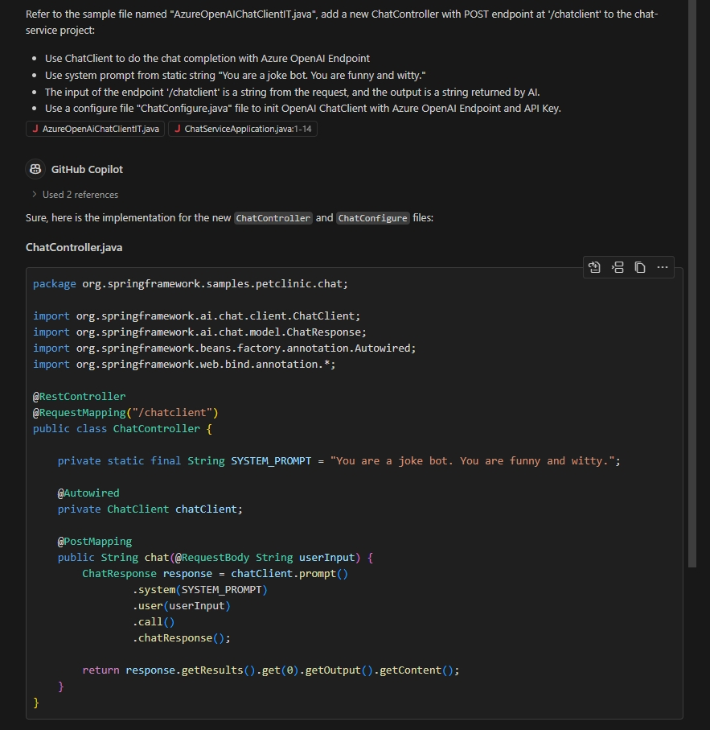
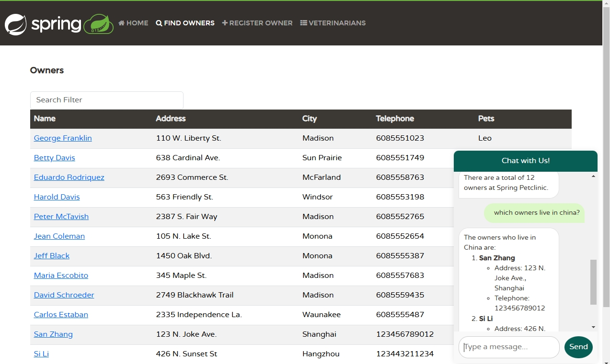

# Create AI application with Azure OpenAI and Apring AI

In this chapter, we will learn how to create AI Java applications using Azure OpenAI and Spring AI.

We will start by creating a new Spring Boot application to connect with Azure OpenAI. Then we'll implement a simple chatbot using Azure OpenAI's GPT-4o model to demonstrate seamless AI integration into the existing petclinic Java applications.

We utilize the `Github Copilot Chat` extension in VSCode to help us to initial the first version of AI application.

# Step by step guide

1. Update service `api-gateway` to add a new chat window.

   - Add new route entry for `chat-service`. Note this name will be used later. Open file `spring-petclinic-api-gateway/src/main/resources/application.yml` and append new entry like below:

    ```yml
           - id: chat-service
             uri: lb://chat-service
             predicates:
               - Path=/api/chat/**
             filters:
               - StripPrefix=2
     ```

   - Add chatbox for api gateway

   ```bash
   git apply -f ../tools/api-gateway-chatbox.patch
   ```

   - Rebuild the api-gateway project and update the container app.

   ```bash
   APP_NAME=api-gateway
   mvn clean package -DskipTests -pl spring-petclinic-$APP_NAME
   az containerapp update --name $APP_NAME --resource-group $RESOURCE_GROUP \
       --source ./spring-petclinic-$APP_NAME
   ```

   - Check the new chatbox in the petclinic page.

   ```bash
   api_gateway_FQDN=$(az containerapp show \
     --resource-group $RESOURCE_GROUP \
     --name $APP_NAME \
     --query properties.configuration.ingress.fqdn \
      -o tsv)

   echo https://$api_gateway_FQDN
   ```

   Open the api-gateway url and there is a chatbox at the right bottom corner.

   

1. Create a new spring boot application

   We create a new spring boot application from [spring initializr](https://start.spring.io/). First we need a `Web` base spring boot applicaiton. And this is an AI application so we add the dependency `Azure OpenAI`. To running and monitoring well in Azure Container Apps, we add some dependencies like `Spring Boot Actuator`, `Config Client` and `Eureka Discovery Client`.

   Fill the other variables according to the structure of the existing petclinic microservices. Use the command below to create the new service:

   ```bash
   mkdir spring-petclinic-chat-service

   curl https://start.spring.io/starter.tgz \
   -d dependencies=web,cloud-eureka,cloud-config-client,actuator,lombok,spring-ai-azure-openai \
   -d bootVersion=3.3.6 -d name=chat-service -d type=maven-project \
   -d jvmVersion=17 -d language=java -d packaging=jar \
   -d groupId=org.springframework.samples.petclinic -d artifactId=chat-service \
   -d description="Spring Petclinic Chat Service" \
   | tar -xzvf - -C spring-petclinic-chat-service
   ```

   We may open the new application in VSCode to next operations.

   ```bash
   code spring-petclinic-chat-service
   ```

   Edit with VSCode will accelerate your work in the next steps.

1. Open file `ChatServiceApplication.java` in the new project, add `@EnableDiscoveryClient` annotation to the class `ChatServiceApplication`. This will enable the new application visit the other service via eureka registred names.

   Fix the alert via VSCode hint like below.

   

1. Generate the first AI code

   GitHub Copilot is specially trained LLM model that can generate code snippets based on the context. As Spring AI is very new project and the LLM model may not have the latest knowledge about Spring AI. To overcome this limitation, we can use the prompt engineering to provide the context to Copilot.

   Here we use the latest test code from Spring AI as part of the prompt. Download the latest chat client sample to your local environment:

   ```bash
   wget https://raw.githubusercontent.com/spring-projects/spring-ai/refs/heads/main/models/spring-ai-azure-openai/src/test/java/org/springframework/ai/azure/openai/AzureOpenAiChatClientIT.java -P spring-petclinic-chat-service/src/main/resources/
   ```

   Open the `Github Copilot Chat` window and drag the downloaded file to the chat window. And input the prompt:

   ```text
   * In the existed workspace, create a new ChatController with POST endpoint at '/chatclient' that provides the chat completion
   * Use ChatClient to do the chat completion with Azure OpenAI Endpoint
   * Use User Prompt from request body as String and save sample System Prompt
   * The input of the endpoint is a string from the request and output a string from chat prompt
   * Use a ChatConfigure file to init OpenAI ChatClient with Azure OpenAI Endpoint and API Key
   ```

   You will see screen like this:

   

   

   

   Follow the steps to make changes to your project.

1. Build and run your first AI application.

   First update the system prompt. Replace the system prompt with new:

   ```text
   You are a friendly AI assistant designed to help with the management of a veterinarian pet clinic called Spring Petclinic.
   Your job is to answer questions about and to perform actions on the user's behalf, mainly around veterinarians, owners, owners' pets and owners' visits.
   You are required to answer an a professional manner. If you don't know the answer, politely tell the user you don't know the answer, then ask the user a followup question to try and clarify the question they are asking.
   If you do know the answer, provide the answer but do not provide any additional followup questions.
   When dealing with vets, if the user is unsure about the returned results, explain that there may be additional data that was not returned.
   Only if the user is asking about the total number of all vets, answer that there are a lot and ask for some additional criteria.
   For owners, pets or visits - provide the correct data.
   ```

   You might need some minor fixes in the AI generated code. Some of the fixes including:

   - Add a new line `spring.config.import=optional:configserver:${CONFIG_SERVER_URL:http://localhost:8888/}` to file `src/main/resources/application.properties`.
   - In ChatController.java: `response.getResults().get(0).getOutput().getText()` --> `response.getResults().get(0).getOutput().getContent()`
   - In ChatConfigure.java: `AzureOpenAiChatOptions.builder().deploymentName("gpt-4o").maxTokens(1000).build());` --> `AzureOpenAiChatOptions.builder().withDeploymentName("gpt-4o").withMaxTokens(1000).build());`
   - In ChatController.java, if the generated code use `String systemPrompt = Files.readString(systemTextResource.getFile().toPath());` to read system prompts from file, rewrite it to `String systemPrompt = FileCopyUtils.copyToString(new InputStreamReader(systemTextResource.getInputStream()));`. Or this works in local environment, but will fail with error message like `java.io.FileNotFoundException: class path resource [prompts/system-message.st] cannot be resolved to absolute file path because it does not reside in the file system: jar:nested:/app.jar/!BOOT-INF/classes/!/prompts/system-message.st`.

   In your VSCode terminal:

   Build and run the new project locally:

   ```bash
   export AZURE_OPENAI_API_KEY="<AZURE-OPENAI-API-KEY>"
   export AZURE_OPENAI_ENDPOINT="<AZURE-OPENAI-ENDPOINT>"

   mvn clean package -DskipTests

   mvn spring-boot:run
   ```

   In another command line window, verifty the service with

   ```bash
   curl -XPOST http://localhost:8080/chatclient -d 'hi'
   ```

   You are expected to see some message from the chat bot like `Hello! How can I assist you today with matters related to Spring Petclinic?`.

1. Deploy the `chat-service` to your Container Apps Environment.

   In your commandline environment, run:

   ```bash
   APP_NAME=chat-service

   AZURE_OPENAI_API_KEY="<AZURE-OPENAI-API-KEY>"
   AZURE_OPENAI_ENDPOINT="<AZURE-OPENAI-ENDPOINT>"

   cp -f ../tools/Dockerfile ./spring-petclinic-$APP_NAME/Dockerfile
   az containerapp create \
       --name $APP_NAME \
       --resource-group $RESOURCE_GROUP \
       --environment $ACA_ENVIRONMENT \
       --source ./spring-petclinic-$APP_NAME \
       --registry-server $MYACR.azurecr.io \
       --registry-identity $APPS_IDENTITY_ID \
       --ingress internal \
       --target-port 8080 \
       --min-replicas 1 \
       --env-vars AZURE_OPENAI_API_KEY="$AZURE_OPENAI_API_KEY" AZURE_OPENAI_ENDPOINT="$AZURE_OPENAI_ENDPOINT" \
       --bind $JAVA_CONFIG_COMP_NAME $JAVA_EUREKA_COMP_NAME \
       --runtime java
   ```

   In your browser navigate to the [Azure portal](http://portal.azure.com) and find the container app `chat-service`. Check the details.

1. Open the chat-agent page and talk to the AI bot.

   You may found the AI bot do not know anything about your petclinic environment. And what it knows is some legacy information.

   - It always return 10 owners with legacy information.
   - It will tell owner info which does not exist.

   Let's improve this in the next step.

1. Function Calling with SpringAI

   In this section, we will implement a basic RAG (Retrieval-Augmented Generation) pattern using Spring AI. The Retrieval-Augmented Generation (RAG) pattern is an industry standard approach to building applications that use large language models to reason over specific or proprietary data that is not already known to the large language model. This is critical because Azure Open AI model that we integrated in the previous step don't know anything about the PetClinic application. Refer to [Spring AI FunctionCallback API](https://docs.spring.io/spring-ai/reference/1.0/api/function-callback.html) for more information.

   {: .note }
   The Spring AI API is under development and the interface may change time to time. At this moment, we are using the API version `1.0.0-M4` in this sample.

   In this sample, we will implement a FunctionCallback interface for AI to get the owners information from existing petclinic solution.

   For demo purpose, we put the source code files into the same code directory.

   - Create a new folder named `model` and add a class `Owner` for owner details.

   ```java
   package org.springframework.samples.petclinic.chat.model;

   import lombok.Data;

   import java.io.Serializable;

   @Data
   public class Owner implements Serializable {

   private Integer id;

   private String firstName;

   private String lastName;

   private String address;

   private String city;

   private String telephone;
   }
   ```

   - Create a new folder named `services` and create class `OwnerService` to retrieve owner info from `api-gateway`.

   ```java
   package org.springframework.samples.petclinic.chat.services;

   import java.util.List;

   import org.springframework.core.ParameterizedTypeReference;
   import org.springframework.http.HttpMethod;
   import org.springframework.samples.petclinic.chat.model.Owner;
   import org.springframework.stereotype.Service;
   import org.springframework.web.client.RestTemplate;

   @Service
   public class OwnerService {

       public List<Owner> getOwners() {

           RestTemplate restTemplate = new RestTemplate();
           var responseEntity = restTemplate.exchange(
                   "http://api-gateway/api/customer/owners",
                   HttpMethod.GET,
                   null,
                   new ParameterizedTypeReference<List<Owner>>() {
                   });

           List<Owner> owners = responseEntity.getBody();
           return owners;
       }
   }
   ```

   - Add FunctionCallbacks to chat client.

     First Add an attribute to ChatController"

     ```java
     @Autowired
     private OwnerService ownerService;
     ```

     Add Functions to chat client. The new code segment would like, see the `functions` part.

     ```java
             ChatResponse response = this.chatClient.prompt()
                .system(systemPrompt)
                .user(userPrompt)
                .functions(FunctionCallback.builder()
                        .description("list all owners")
                        .method("getOwners")
                        .targetObject(ownerService)
                        .build())
                .call()
                .chatResponse();
     ```

     Fix the `import` issues with the help of VSCode.

   - Rebuild the project in the VSCode termimal window:

   ```bash
   mvn clean package -DskipTests
   ```

   - Update the chat-service in your commandline window:

   ```bash
   az containerapp update --name $APP_NAME --resource-group $RESOURCE_GROUP \
    --source ./spring-petclinic-$APP_NAME
   ```

   - Verify the new RAG empowered AI bot about owners.

   

1. Enhance the AI model by adding more function callbacks.
