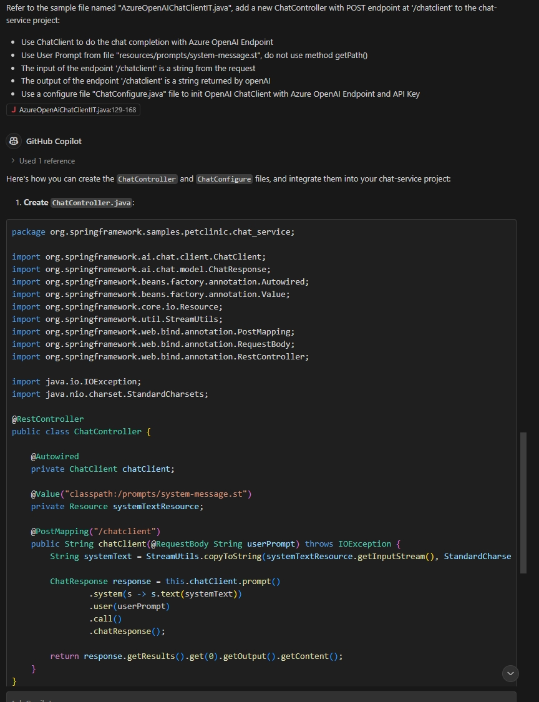
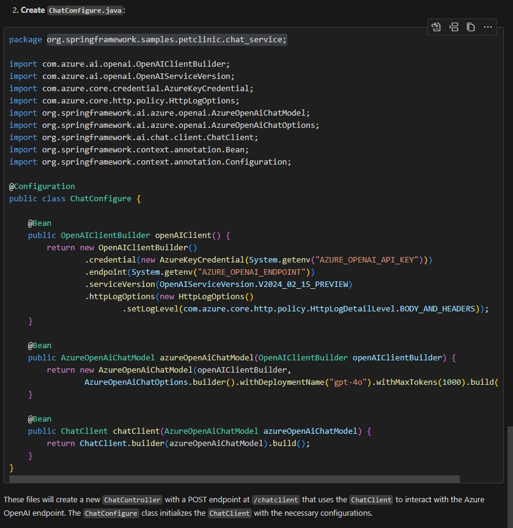

# Integrate AI into your existing project

In this chapter, we will learn how to create AI Java applications using Azure OpenAI and Spring AI.

Start from a simple spring boot application, we will add AI components to the project and leverage AI to integrate with existing the petclinic solution we deployed in this lab.

# Step by step guide

1. We have simple sample saved in the tools directory, copy it under the folder `spring-petclinic-microservices`:

   ```bash
   cp -r ../tools/spring-petclinic-chat-service .
   ```

1. Open the chat-service project in VSCode

   ```bash
   code spring-petclinic-chat-service
   ```

1. In the VSCode IDE, make sure you have extension `Github Copilot Chat` installed, and login to Copilot with your github account.

   Open the Github Copilot Chat Window, you can ask copliot in the "Ask Copilot" input box.

1. Create a file for your system prompt.

   Create file `src/main/resources/prompts/system-message.st` with content

   ```text
   You are a chatbot good at telling jokes.
   ```

1. Ask Copilot to create code for open AI integration.

   Click the file `src/main/resources/AzureOpenAiChatClientIT.java`, and input the following prompt to "Ask Copilot":

   ```text
   Refer to the sample file named "AzureOpenAIChatClientIT.java", add a new ChatController with POST endpoint at '/chatclient' to the chat-service project:
   * Use ChatClient to do the chat completion with Azure OpenAI Endpoint
   * Use User Prompt from file "resources/prompts/system-message.st", do not use method getPath()
   * The input of the endpoint '/chatclient' is a string from the request
   * The output of the endpoint '/chatclient' is a string returned by openAI
   * Use a configure file "ChatConfigure.java" file to init OpenAI ChatClient with Azure OpenAI Endpoint and API Key
   ```

   You will see output like:

   

   

1. Follow the steps to make changes to the project.

   In the VSCode terminal (current directory `spring-petclinic-chat-service`), run maven command to build the project:

   ```bash
   mvn clean package
   ```

   Fix the erorrs if there are any.

1. Verify the chat endpoint.

   - In the VSCode terminal, set the endpoint and api-key of your open ai instance, and run the app:

   ```bash
   export AZURE_OPENAI_API_KEY="<OPENAI-API-KEY>"
   export AZURE_OPENAI_ENDPOINT="<OPENAI-ENDPOINT>"

   mvn spring-boot:run
   ```

   Ignore the warnings on `c.n.discovery.InstanceInfoReplicator`.

   - In your commandline environment, verify the '/chatclient' endpoint with simple command:

   ```bash
   curl -XPOST http://localhost:8080/chatclient -d 'Hi, tell a joke'
   ```

   You will get a joke generated by OpenAI. Congratulations!

1. Deploy the `chat-service` to your Container Apps Environment.

   In your commandline environment (current directory `spring-petclinic-microservices`), run:

   ```bash
   APP_NAME=chat-service

   AZURE_OPENAI_API_KEY="<AZURE-OPENAI-API-KEY>"
   AZURE_OPENAI_ENDPOINT="<AZURE-OPENAI-ENDPOINT>"

   cp -f ../tools/Dockerfile ./spring-petclinic-$APP_NAME/Dockerfile
   az containerapp create \
       --name $APP_NAME \
       --resource-group $RESOURCE_GROUP \
       --environment $ACA_ENVIRONMENT \
       --source ./spring-petclinic-$APP_NAME \
       --registry-server $MYACR.azurecr.io \
       --registry-identity $APPS_IDENTITY_ID \
       --ingress external \
       --target-port 8080 \
       --min-replicas 1 \
       --max-replicas 1 \
       --env-vars AZURE_OPENAI_API_KEY="$AZURE_OPENAI_API_KEY" AZURE_OPENAI_ENDPOINT="$AZURE_OPENAI_ENDPOINT" \
       --bind $JAVA_EUREKA_COMP_NAME \
       --runtime java
   ```

   In your browser navigate to the [Azure portal](http://portal.azure.com) and find the container app `chat-service`. Check the details.

   Verify chat-service in Azure Container Apps.

   ```bash
   CHAT_URL=$(az containerapp show \
       --resource-group $RESOURCE_GROUP \
       --name $APP_NAME \
       --query properties.configuration.ingress.fqdn \
       -o tsv)

   curl -XPOST https://$CHAT_URL/chatclient -d 'Hi, tell a joke'
   ```

1. Function Calling with SpringAI

   In this section, we will implement a basic RAG (Retrieval-Augmented Generation) pattern using Spring AI. The Retrieval-Augmented Generation (RAG) pattern is an industry standard approach to building applications that use large language models to reason over specific or proprietary data that is not already known to the large language model. This is critical because Azure Open AI model that we integrated in the previous step don't know anything about the PetClinic application. Refer to [Spring AI FunctionCallback API](https://docs.spring.io/spring-ai/reference/1.0/api/function-callback.html) for more information.

   {: .note }
   The Spring AI API is under development and the interface may change time to time. At this moment, we are using the API version `1.0.0-M4` in this sample.

   In this sample, we will implement a FunctionCallback interface for AI to get the owners information from existing petclinic solution.

   - Create a new `Owner.java` for owner details.

   ```java
   package org.springframework.samples.petclinic.chat_service;

   import lombok.Data;

   import java.io.Serializable;

   @Data
   public class Owner implements Serializable {

       private Integer id;

       private String firstName;

       private String lastName;

       private String address;

       private String city;

       private String telephone;
   }
   ```

   - Create a new file `OwnerService.java` to retrieve owner info from `api-gateway`.

   ```java
   package org.springframework.samples.petclinic.chat_service;

   import java.util.List;

   import org.springframework.core.ParameterizedTypeReference;
   import org.springframework.http.HttpMethod;
   import org.springframework.stereotype.Service;
   import org.springframework.web.client.RestTemplate;

   @Service
   public class OwnerService {

       public List<Owner> getOwners() {

           RestTemplate restTemplate = new RestTemplate();
           var responseEntity = restTemplate.exchange(
                   "http://api-gateway/api/customer/owners",
                   HttpMethod.GET,
                   null,
                   new ParameterizedTypeReference<List<Owner>>() {
                   });

           List<Owner> owners = responseEntity.getBody();
           return owners;
       }
   }
   ```

   - Add FunctionCallbacks to chat client.

     First Add an attribute to ChatController"

     ```java
     @Autowired
     private OwnerService ownerService;
     ```

     Add Functions to chat client. The new code segment would like, see the `functions` part.

     ```java
         ChatResponse response = this.chatClient.prompt()
                  .system(s -> s.text(systemText))
                  .user(userPrompt)
                  .functions(FunctionCallback.builder()
                           .description("list all owners")
                           .method("getOwners")
                           .targetObject(ownerService)
                           .build())
                  .call()
                  .chatResponse();
     ```

     Fix the `import` issues with the help of VSCode.

   - Rebuild the project in the VSCode termimal window (current directory spring-petclinic-chat-service):

   ```bash
   mvn clean package -DskipTests
   ```

   - Update the chat-service in your commandline window (current directory spring-petclinic-microservices):

   ```bash
   az containerapp update --name $APP_NAME --resource-group $RESOURCE_GROUP \
       --source ./spring-petclinic-$APP_NAME
   ```

   Verify the AI integrated with spring petclinic output:

   ```bash
   curl -XPOST https://$CHAT_URL/chatclient -d 'list the names of the owners'

   curl -XPOST https://$CHAT_URL/chatclient -d 'list the owners from Madison'
   ```

   You may create more owners in the api-gateway page and ask more questions on the owners. Note, here we only implemented the owner function.

1. Here we have finished the first function for AI component to communicate with the existing system. Future more:

   - You may add more functions to empower the AI strenght. Just like the getOwners sample.
   - You may integration a chatbox in the api-gateway page. see [Chatbox in api-gateway](#optional-integrate-the-chat-client-into-api-gateway).

# (Optional) Integrate the chat client into api-gateway

1. Update service `api-gateway` to add a new chat window.

   - Add new route entry for `chat-service`. Note this name will be used later. Open file `spring-petclinic-api-gateway/src/main/resources/application.yml` and append new entry like below:

    ```yml
           - id: chat-service
             uri: lb://chat-service
             predicates:
               - Path=/api/chat/**
             filters:
               - StripPrefix=2
     ```

   - Add chatbox for api gateway

   ```bash
   git apply -f ../tools/api-gateway-chatbox.patch
   ```

   - Rebuild the api-gateway project and update the container app.

   ```bash
   APP_NAME=api-gateway
   mvn clean package -DskipTests -pl spring-petclinic-$APP_NAME
   az containerapp update --name $APP_NAME --resource-group $RESOURCE_GROUP \
       --source ./spring-petclinic-$APP_NAME
   ```

   - Check the new chatbox in the petclinic page.

   ```bash
   api_gateway_FQDN=$(az containerapp show \
     --resource-group $RESOURCE_GROUP \
     --name $APP_NAME \
     --query properties.configuration.ingress.fqdn \
      -o tsv)

   echo https://$api_gateway_FQDN
   ```

   Open the api-gateway url and there is a chatbox at the right bottom corner.

   

1. Verify the new RAG empowered AI bot about owners.

   

# (Optional) Prepare the simple project

1. Create a project from [spring initializr](https://start.spring.io/):

   ```bash
   curl https://start.spring.io/starter.tgz \
       -d dependencies=web,cloud-eureka,actuator,lombok,spring-ai-azure-openai \
       -d name=chat-service -d type=maven-project \
       -d jvmVersion=17 -d language=java -d packaging=jar \
       -d groupId=org.springframework.samples.petclinic -d artifactId=chat-service \
       -d description="Spring Petclinic Chat Service" \
       | tar -xzvf - -C spring-petclinic-chat-service
   ```

1. Update `application.properties` to `application.yml`

   ```yml
   spring:
     application:
       name: chat-service
   ```

1. Version

   Verify the version of spring-ai is `1.0.0-M4`

   Download the template file from branch `1.0.0.4`

   ```bash
   IT_FILE="https://raw.githubusercontent.com/spring-projects/spring-ai/refs/heads/1.0.0-M4/models/spring-ai-azure-openai/src/test/java/org/springframework/ai/azure/openai/AzureOpenAiChatClientIT.java"
   wget $IT_FILE -P spring-petclinic-chat-service/src/main/resources/
   ```

1. Enable Eureka Client in class `ChatServiceApplication`:

   
