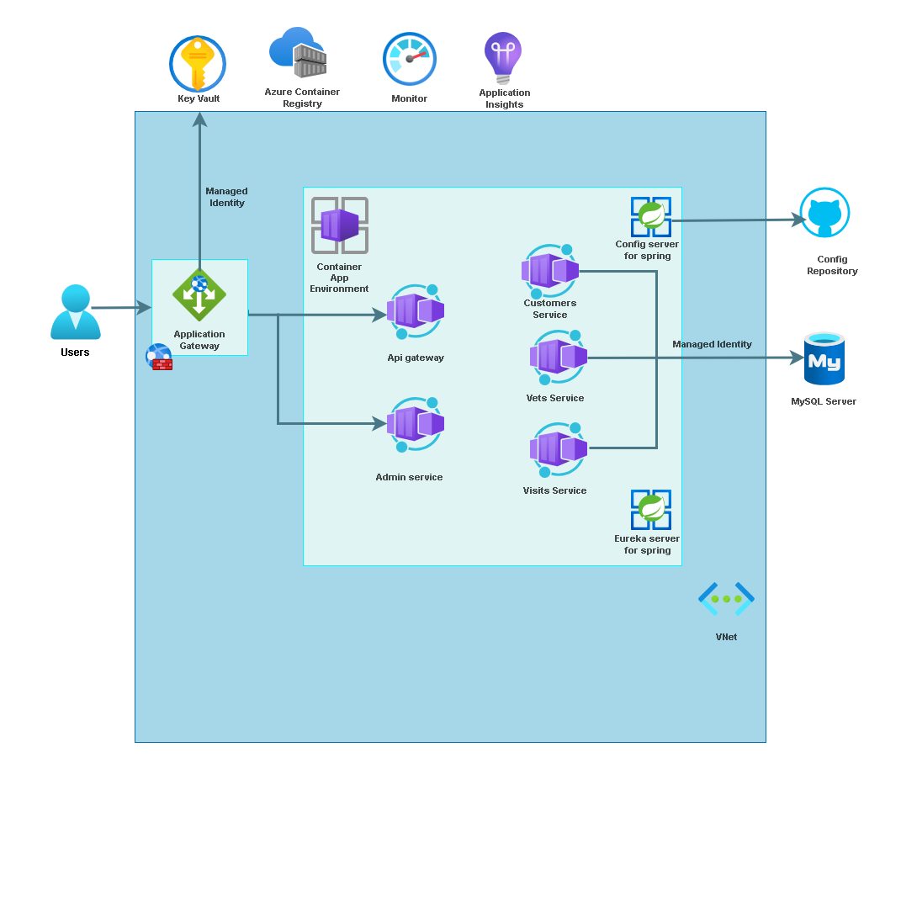

# Lab 5: Integrate Azure OpenAI Service with your applications

## Introduction

[Azure OpenAI Service](https://learn.microsoft.com/azure/ai-services/openai/overview) is a cloud-based service that provides access to the powerful AI models of OpenAI. With Azure OpenAI, you can easily add large-scale, generative AI capabilities to your applications, integrating powerful interactive reasoning, natural language processing, and code generation capabilities with minimal additional effort.

In this lab, you’ll extend the Spring Petclinic Microservices application that you deployed in our previous sessions by building and integrating an intelligent chat agent application powered by Azure OpenAI.

## What you’ll cover

As you work through this lab, you’ll learn how to:

- Create an Azure OpenAI instance and deploy language models to it.
- Deploy a sample AI chat service application to Azure Container Apps and use it to explore the power of Azure OpenAI.

The following image illustrates how your application’s architecture should look after you’ve completed this lab.

## Duration

**Estimated time:** 60 minutes

{: .note }
> This lab assumes that you successfully completed the previous labs and are using the same lab environment, including your command-line session, with the relevant environment variables already set.
