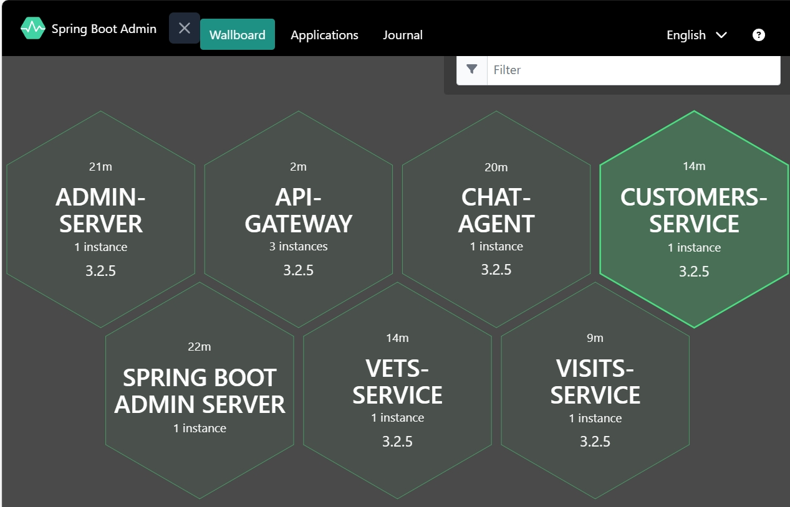

# 2. Run Azd Command to deploy

Run `azd up` to deploy the petclinic solution and dependent components to Azure Container App

## Step by step guidance

1. Run `azd up`
   Fill the variables required from the prompt:

   ```text
   ? Enter a new environment name: <env-name>
   ? Select an Azure Subscription to use: xxx xxx
   ? Select an Azure location to use: xxx
   ```

{: .note }
   > You may find the settings in directory `.azure/<env-name>/`

   By default, `azd privison` is triggered with pre-build images for this lab.
   This step will create all the azure resource defined for the projects.

   If you meet any problems during this step, refer to page [Triage the issues]()

   It will take about 15 minutes to finish.

   ```text
     (✓) Done: Resource group: rg-sonwan-ncu (2.923s)
     (✓) Done: Virtual Network: vnet-sonwan-ncu (12.99s)
     (✓) Done: Log Analytics workspace: la-sonwan-ncu (16.279s)
     (✓) Done: Application Insights: app-insights-sonwan-ncu (3.347s)
     (✓) Done: Container Registry: crw7qfcs2ltijjm (18.887s)
     (✓) Done: Azure OpenAI: openai-sonwan-ncu (19.379s)
     (✓) Done: Azure AI Services Model Deployment: openai-sonwan-ncu/text-embedding-ada-002 (1.35s)
     (✓) Done: Azure AI Services Model Deployment: openai-sonwan-ncu/gpt-4o (2.15s)
     (✓) Done: Container Apps Environment: aca-env-sonwan-ncu (2m58.069s)
     (✓) Done: Azure Database for MySQL flexible server: sql-sonwan-ncu (4m6.361s)
     (✓) Done: Container App: vets-service (17.238s)
     (✓) Done: Container App: chat-agent (17.3s)
     (✓) Done: Container App: api-gateway (17.42s)
     (✓) Done: Container App: admin-server (17.356s)
     (✓) Done: Container App: visits-service (16.956s)
     (✓) Done: Container App: customers-service (17.152s)
   
   SUCCESS: Your up workflow to provision and deploy to Azure completed in 11 minutes 48 seconds.
   ```

1. Visit the api gateway service

   - Get the spring boot admin url from azd environment variables
   `azd env get-values | grep gatewayFqdn`
   
   - Visit the api-gateway url:
   `api-gateway.<cluster-name>.<region>.azurecontainerapps.io`

   

1. Visit the spring boot admin server

   - Get the spring boot admin url from azd environment variables
   `azd env get-values | grep springbootAdminFqdn`

   - Visit the spring boot admin page url:
   `springbootadmin-azure-java.ext.<cluster-name>.<region>.azurecontainerapps.io`

   
