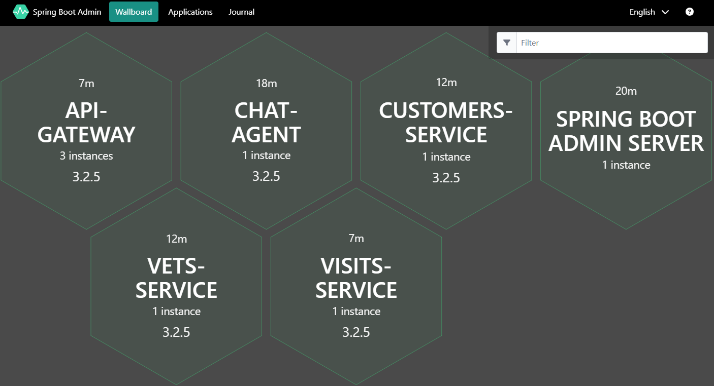

# 2. Run Azd Command to deploy

Run `azd up` to deploy the petclinic solution and dependent components to Azure Container App

## Step by step guidance

1. Run `azd up`
   Fill the variables required from the prompt:

   ```text
   ? Enter a new environment name: <env-name>
   ? Select an Azure Subscription to use: xxx xxx
   ? Select an Azure location to use: xxx
   ```

{: .note }
   > You may find the settings in directory `.azure/<env-name>/`

   By default, `azd privison` is triggered with pre-build images for this lab.
   This step will create all the azure resource defined for the projects.

   If you meet any problems during this step, refer to page [Triage the issues]()

   It will take about 20 minutes to finish.

1. Visit the api gateway service

   - Get the spring boot admin url from azd environment variables
   `azd env get-values | grep gatewayFqdn`
   
   - Visit the api-gateway url:
   `api-gateway.<cluster-name>.<region>.azurecontainerapps.io`

   

1. Visit the spring boot admin server

   - Get the spring boot admin url from azd environment variables
   `azd env get-values | grep springbootAdminFqdn`

   - Visit the spring boot admin page url:
   `springbootadmin-azure-java.ext.<cluster-name>.<region>.azurecontainerapps.io`

   
