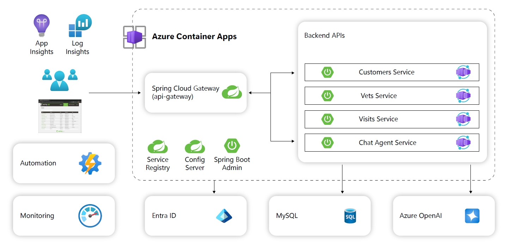

# Deploy to Azure automatically

# Student manual

## Lab scenario

In the Lab 2, Lab 3, Lab 4 and Lab 5 we deploy the petclinic microservice solution to Azure Container Apps step by step.
These steps are full of details but time costing.

In this lab, we introduce a new tool [azd](https://learn.microsoft.com/en-us/azure/developer/azure-developer-cli/) to help deploy the solution to Azure with single command.

## Objectives

After you complete this lab, you will be able to:

- Get familiar with the azd tool.
- Deploy the petclinic solution (with AI) to new ACA environment.
- Test your setup.

## Lab Duration

- **Estimated Time**: 30 minutes

## Instructions

During this lab, you will:

- Deploy the sample microservices to Azure Container Apps automatically.
- Learn how to triage some problems with the one-click solution.

## Others

- This version of azd templates includes most operations in:
   - [Lab 2: Launch a Spring Apps microservices application to Azure Container Apps]()
   - [Lab 3: Enable monitoring and end-to-end tracing]()
   - [Lab 4: Connect to Database securely using identity]()
   - [Lab 5: Integrate with Azure OpenAI]()

- By default, the automation process will create MySQL server admin password with random string, you can reset the admin password in either way:
   - Portal: Go to your MySQL server instance page, navigate to `Overview` and click <kbd>Reset password</kbd>
   - CLI: `az mysql flexible-server update -g <group-name> -n <server-name> --admin-password "<new-password>"`

{: .note }
> The instructions provided in this exercise assume that you successfully completed the previous exercise and are using the same lab environment, including your Git Bash session with the relevant environment variables already set.
