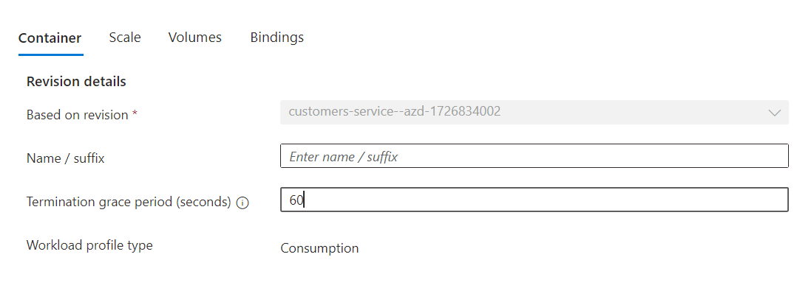
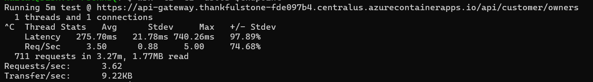

# Graceful shutdown on Java Container Apps
To achieve zero-downtime during a rolling update, gracefully shutting down a Java application is essential. Graceful shutdown refers to the "window of opportunity" an application has to programmatically clean up resources between the time a `SIGTERM` signal is sent to a container app and the time the app actually shuts down (receiving `SIGKILL`). See [Container App Lifecycle Shutdown](https://learn.microsoft.com/en-us/azure/container-apps/application-lifecycle-management#shutdown).

The cleanup behavior may include logic such as:
- Closing database connections
- Waiting for any long-running operations to finish
- Clearing out a message queue
- Etc.

`SIGTERM`can be sent to containers during various shutdown events, including management operations (such as scale in/down or any [Revision-scope changes](https://learn.microsoft.com/en-us/azure/container-apps/revisions#revision-scope-changes)) and internal platform upgrade(e.g. node upgrade). Therefore, it is essential to properly handle the `SIGTERM` signal in the Java applications to achieve zero-downtime.


## Step by step guidance

### 1. Handle SIGTERM signal
In this lab, we will guide you on how to properly handle Eureka cache issues and long HTTP requests when receiving the `SIGTERM` signal.

#### 1.1 Add a Shutdown Hook for Spring Cloud Applications

Eureka is designed to be an eventually consistent system. When an upstream service app is shut down, the service-consuming app (i.e., client app) will not see the registry update immediately and will continue to send requests to the upstream app. If the upstream app shuts down immediately, the client app will receive `5xx` network/IO exceptions.

To gracefully shut down an upstream app that offers services via Eureka service discovery, you need to catch the `SIGTERM` signal and follow the deregister-then-wait pattern:
1) Deregister the instance from the Eureka server.
2) Wait until all client apps refresh their Eureka cache.
3) Shut down the application.

To implement this, you may refer the sample code [EurekaGracefulShutdown.java](https://github.com/Azure-Samples/java-microservices-aca-lab/blob/main/src/spring-petclinic-customers-service/src/main/java/org/springframework/samples/petclinic/customers/shutdown/EurekaGracefulShutdown.java)

```java
@Component
@Slf4j
public class EurekaGracefulShutdown {

    @Autowired
    private EurekaInstanceConfigBean eurekaInstanceConfig;
    private static final String STATUS_DOWN = "DOWN";
    private static final int WAIT_SECONDS = 30;

    @EventListener
    public void onShutdown(ContextClosedEvent event) {
        log.info("Caught shutdown event");
        log.info("De-register instance from eureka server");
        eurekaInstanceConfig.setStatusPageUrl(STATUS_DOWN);

        // Wait to continue serve traffic before all Eureka clients refresh their cache
        try {
            log.info("wait {} seconds before shutting down the application", WAIT_SECONDS);
            Thread.sleep(1000 * WAIT_SECONDS); 
        } catch (InterruptedException e) {
            Thread.currentThread().interrupt();
        }
        log.info("Shutdown the application now.");
    }
}
   ```

Note, when setting the `WAIT_SECONDS`, consider the maximum possible Eureka cache intervals, including
- eureka server cache `eureka.server.responseCacheUpdateIntervalMs`
- eureka client cache `eureka.client.registryFetchIntervalSeconds`
- ribbon load balancer cache `ribbon.ServerListRefreshInterval` if ribbon is used

In the Pet Clinic sample, we have already added `EurekaGracefulShutdown` to all the micro-services using eureka as service discovery server.


{: .note }
> Azure Container Apps provides built-in service discovery for microservice applications within the same container environment. You can call a container app by sending a request to `http(s)://<CONTAINER_APP_NAME>` from another app in the environment. For more details, see [Call a container app by name](https://learn.microsoft.com/en-us/azure/container-apps/connect-apps?tabs=bash#call-a-container-app-by-name). If your microservice applications are in the same container environment, you can use this feature to avoid the Eureka cache issue.

#### 1.2 Config graceful shutdown for Spring-boot application
Another common scenario is handling long HTTP operations. Before shutting down the application, the web server needs to finish processing all received HTTP requests.

If the Java application is a Spring Boot application and does not offer services via Eureka, you can simply use Spring Boot’s built-in [graceful shutdown support](https://docs.spring.io/spring-boot/reference/web/graceful-shutdown.html). Otherwise, use the above approach.

```yaml
server.shutdown=graceful
spring.lifecycle.timeout-per-shutdown-phase=30s
```
This configuration uses a timeout to provide a grace period during which existing requests are allowed to complete, but no new requests will be permitted. 

In the Pet Clinic sample, we are using Spring Boot’s graceful shutdown support for the `gateway` application.


### 2. Config terminationGracePeriodSeconds
After adding proper shutdown hooks, configure the `terminationGracePeriodSeconds` in Container Apps to match the cleanup wait time. The `terminationGracePeriodSeconds` defaults to 30 seconds, update it to 60s for app `customers-service`.

- Portal: Go to the `Revisions blade` -> Create a new revision -> Save this new revision.


{: .note }
> You can set a maximum value of 600 seconds (10 minutes) for    terminationGracePeriodSeconds. If an application needs upwards of 10 minutes for cleanup, it is highly recommended to revisit the application’s design to reduce this time.

### 3. Test the application
Use [wrk](https://github.com/wg/wrk) or any traffic emiting tool to verify there is no down-time during application shutdown.

Open a terminal, and emitting traffic with wrk
```bash
endpoint=$api_gateway_FQDN/api/customer/owners
wrk -t1 -c1 -d300s $endpoint
```

Open a new terminal, and restart the revision 
```bash
revision=$(az containerapp revision list \
   --name customers-service \
   --resource-group $RESOURCE_GROUP \
   --query [].name -o tsv)

az containerapp revision restart \
  --revision $revision \
  --resource-group $RESOURCE_GROUP
```

In the first terminal, you should see there is no `5xx` error during the whole application restart time window.



