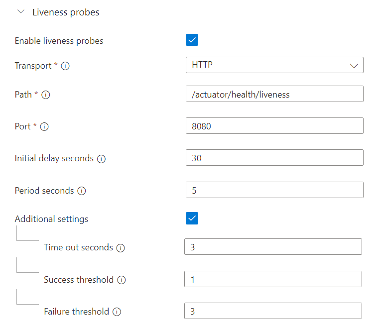
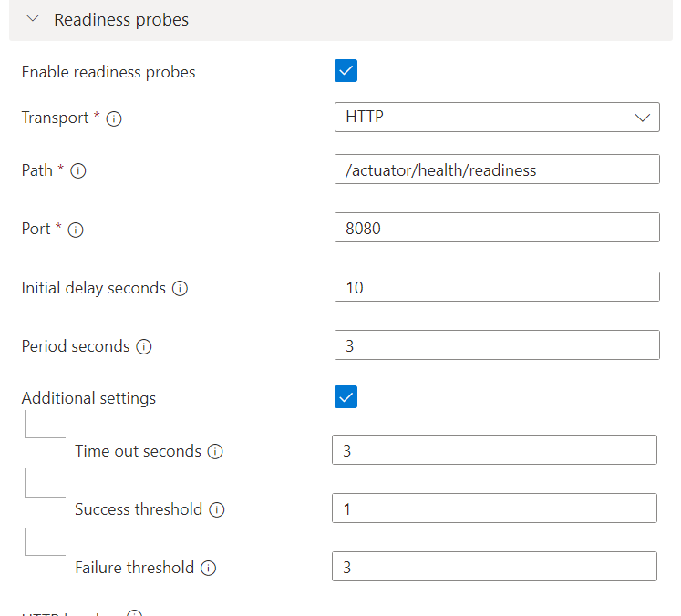

# Config health probes for a Java Application
Azure Container Apps health probes allow the Container Apps runtime to regularly inspect the status of your container apps. 

Container Apps supports the following probes:

- `Startup`. Checks if your application has successfully started. This check is separate from the liveness probe and executes during the initial startup phase of your application.
- `Liveness`. Checks if your application is still running and responsive.
- `Readiness`. Checks to see if a replica is ready to handle incoming requests.

You can find more info on Azuzre doc [Health probes in Azure Container Apps](https://learn.microsoft.com/en-us/azure/container-apps/health-probes?tabs=arm-template). 

Health probes can help work around performance issues related to timeouts during container startup, deadlocks when running the container, and serving traffic when the container is not ready to accept traffic.

## Step by step guidance

### 1. Expose health probes in Spring Boot Application

Spring Boot has out-of-the-box support to [manage your application availability state](https://docs.spring.io/spring-boot/docs/2.3.0.RELEASE/reference/html/production-ready-features.html#production-ready-kubernetes-probes). 

Add bellow configuration into `customers-service.yml`

```yml
management:
  health:
    livenessState:
      enabled: true
    readinessState:
      enabled: true
  endpoint:
    health:
      probes:
        enabled: true

```
With the above configration, two heath endpoints will be exposed via spring-boot actuator
- `/actuator/health/liveness` for application liveness
- `/actuator/health/readiness` for application readiness

### 2. Define a customized health indicator in Spring Boot Application
In Spring Boot app, you can define a customized `HealthIndicator`. Here is a `HealthIndicator` sample in project `customers-service`.
```java
public class ServiceHealthIndicator implements HealthIndicator {

    private final ScheduledExecutorService scheduler = Executors.newScheduledThreadPool(1);
    private boolean isHealthy = false;

    private OwnerRepository ownerRepo;

    public ServiceHealthIndicator(OwnerRepository ownerRepo) {
        this.ownerRepo = ownerRepo;
        scheduler.scheduleAtFixedRate(() -> {
            checkDatabaseStatus();
            if (isHealthy) {
                scheduler.shutdown();
            }
        }, 10, 5, TimeUnit.SECONDS);
    }

    private void checkDatabaseStatus() {
        boolean databaseReady = ownerRepo.findAll().size() > 0;
        if (databaseReady) {
            isHealthy = true;
            log.info("Database is healthy. Stopping checks.");
        } else {
            log.info("Database is not healthy. Checking again in 5 seconds.");
        }
    }

    @Override
    public Health health() {
        return isHealthy ? Health.up().build() : Health.down().build();
    }
}
```
In this sample, the code `ServiceHealthIndicator` will report health status `UP` only after some db operation is ready. This can be helpful in some scenarios where you application needs some warmup (e.g. cache/db preload) time before receiving traffic.


### 3. Config Health probes in Azure Container Apps
Health probes can be configed via either Portal or [ARM template](https://learn.microsoft.com/en-us/azure/container-apps/health-probes?tabs=arm-template).


- Portal: Find the application `customers-service` -> Go to the `Revisions blade` -> Create a new revision -> Save this new revision.



Here, we set the `initial delay seconds` in readiness probe to 10 seconds, which align with the above health check logic in `ServiceHealthIndicator`.

{: .note }
> Azure Container Apps is built ontop of Kubernetes, the health probes feature maps closely with Kubernetes Probes, you may gain a deeper understanding on probes from [kubernetes probes](https://kubernetes.io/docs/tasks/configure-pod-container/configure-liveness-readiness-startup-probes/).


