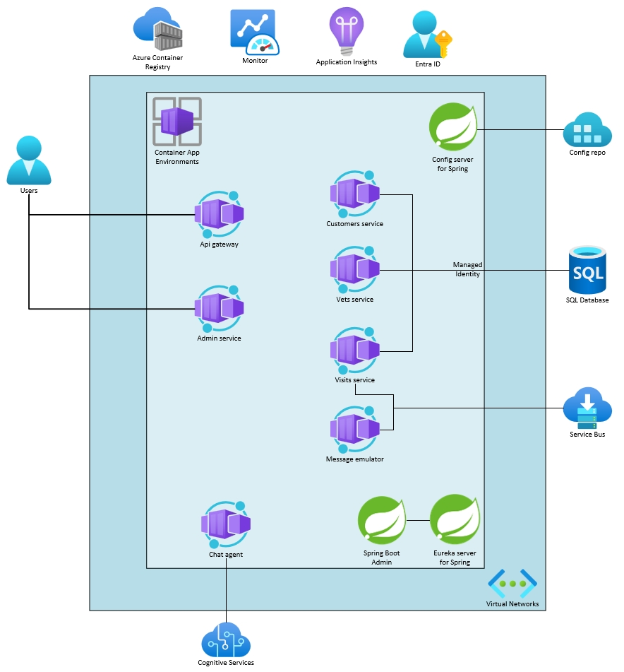

# Build reliable Java application on Azure Container Apps

# Student manual

## Lab scenario

Azure Container Apps has a richful set of features available to help you build reliable Java applications. In this Lab, you will learn how to design and maintain your app for long-term health and stability. You can find more infomation on
- [Management and operations for the Azure Container Apps - Landing Zone Accelerator](https://learn.microsoft.com/en-us/azure/cloud-adoption-framework/scenarios/app-platform/container-apps/management)

## Objectives

After you complete this lab, you will be able to:

- Gracefully shut down a Java application
- Config health probes for a Java Application

The below image illustrates the end state you will be building in this lab.

## Lab Duration

- **Estimated Time**: 60 minutes

## Instructions

During this lab, you will:

- Add appropiate shutdown hook to a Java application
- Config health probes for a Java application

{: .note }
> The instructions provided in this exercise assume that you successfully completed the previous exercise and are using the same lab environment, including your commandline session with the relevant environment variables already set.
