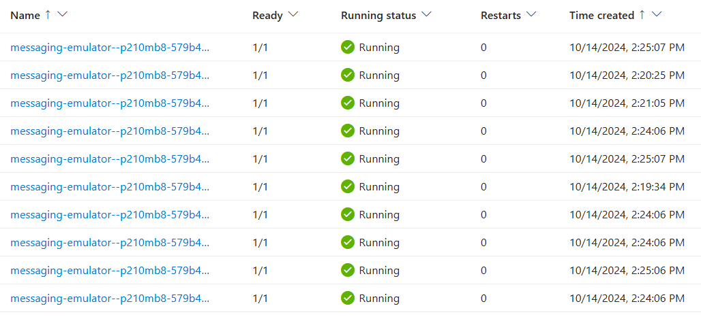
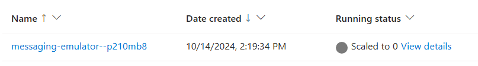

# Set up an HTTP scaling rule

First, you will set up an HTTP scaling rule based on the number of concurrent HTTP requests to the revision of the existing `messaging-emulator` application. Every 15 seconds, the number of concurrent requests is calculated as the number of requests in the past 15 seconds divided by 15. 

In the following example, the revision scales out up to a maximum of ten replicas and can scale in to zero. The scaling threshold is set to 5 concurrent requests per second.

## Step by step guidance

1. Add an HTTP scale rule to your container app `messaging-emulator` by running the `az containerapp update` command.
   ```bash
   APP_NAME=messaging-emulator
   az containerapp update \
     --name $APP_NAME \
     --resource-group $RESOURCE_GROUP \
     --min-replicas 0 \
     --max-replicas 10 \
     --scale-rule-name http-scale-rule \
     --scale-rule-type http \
     --scale-rule-http-concurrency 5
   ```

1. You can observe the effects of your application scaling by viewing the logs generated by the Container Apps runtime. Use the `az containerapp logs show` command to start listening for log entries. The command returns entries from the system logs for your container app in real time. 
   ```bash
   az containerapp logs show \
     --name $APP_NAME \
     --resource-group $RESOURCE_GROUP \
     --type=system \
     --follow=true
   ```

1. Open a new bash shell. Run the following command to send 100 requests to the `messaging-emulator` container app in concurrent batches of 20 requests each.
   ```bash
   messaging_emulator_FQDN=$(az containerapp show \
     --resource-group $RESOURCE_GROUP \
     --name $APP_NAME \
     --query properties.configuration.ingress.fqdn \
     -o tsv)
   seq 1 100 | xargs -Iname -P20 curl https://$messaging_emulator_FQDN
   ```

1. In the first shell where you ran the `az containerapp logs show` command, the output now contains one or more log entries like the following.
   ```bash
   {
       "TimeStamp": "2024-10-14 06:20:09 +0000 UTC",
       "Type": "Normal",
       "ContainerAppName": "messaging-emulator",
       "RevisionName": "messaging-emulator--cllivqj",
       "ReplicaName": "messaging-emulator--cllivqj-7988dc4545-x27gv",
       "Msg": "Replica 'messaging-emulator--cllivqj-7988dc4545-x27gv' has been scheduled to run on a node.",
       "Reason": "AssigningReplica",
       "EventSource": "ContainerAppController",
       "Count": 0
   }
   ```

1. Navigate to the portal of the container app `messaging-emulator`, expand **Application** and select **Revisions and replicas**, then select **Replicas** tab. You can see the container app now has more than one replica running.


1. After a period of low or no incoming requests, the replicas will gradually scale down to zero. You can also observe the status of revision as **Scaled to zero** in the Azure portal.

