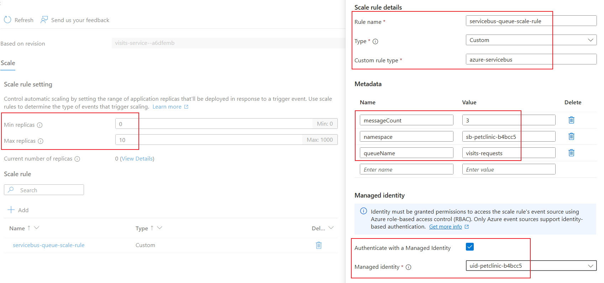
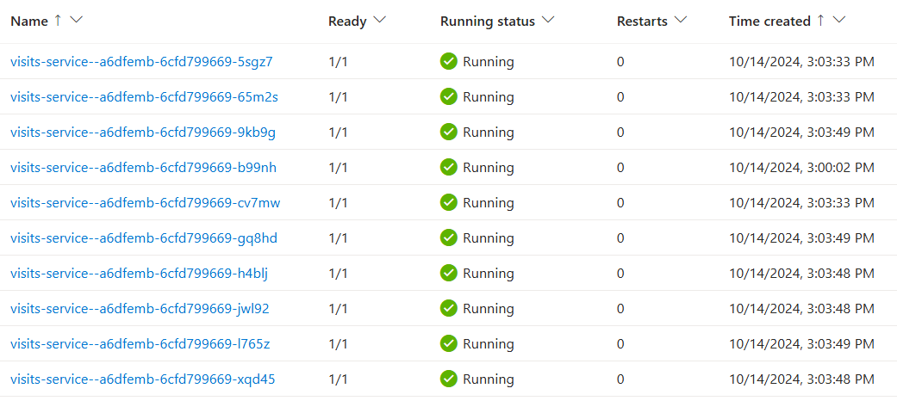
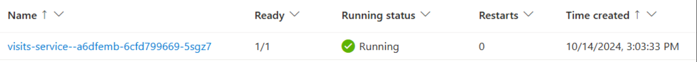

# Set up a custom scaling rule

In addition to the HTTP scaling rule, you can also configure a custom scaling rule based on any [ScaledJob](https://keda.sh/docs/2.15/concepts/scaling-jobs/)-based [KEDA scalers](https://keda.sh/docs/2.15/scalers/). The example below demonstrates how to set up an [Azure Service Bus scaler](https://keda.sh/docs/2.15/scalers/azure-service-bus/) for the `visits-service` container app. Once configured, you can send batch messages to the message queue and observe the auto-scaling behavior of the `visits-service` replicas. After a period of inactivity (no incoming messages), you can see the replicas scaling down to zero.

## Step by step guidance

1. KEDA scaler requires authentication to access the event source of a scale rule (in this case, the Azure service bus). In this lab, we will use a managed identity for authentication. First, retrieve the resource ID of the user-assigned identity.
   ```bash
   APP_NAME=visits-service
   UMI_ID=$(az containerapp show -n $APP_NAME -g $RESOURCE_GROUP --query "identity.userAssignedIdentities | keys(@)[0]" --output tsv)
   ```

1. Add an Azure service bus scale rule to your container app `visits-service` by running the `az containerapp update` command. Specify the **scale-rule-type** as `azure-servicebus`, with a concurrency message count setting of `3`.
   ```bash
   az containerapp update \
     --name $APP_NAME \
     --resource-group $RESOURCE_GROUP \
     --min-replicas 0 \
     --max-replicas 10 \
     --scale-rule-name servicebus-queue-scale-rule \
     --scale-rule-type azure-servicebus \
     --scale-rule-metadata "queueName=visits-requests" \
                           "namespace=$SERVICEBUS_NAMESPACE" \
                           "messageCount=3" \
     --scale-rule-identity $UMI_ID
   ```
   

1. Observe the logs generated by the Container Apps runtime in real time by using the `az containerapp logs show` command.
   ```bash
   az containerapp logs show \
     --name $APP_NAME \
     --resource-group $RESOURCE_GROUP \
     --type=system \
     --follow=true
   ```

1. Open a new bash shell and run the following command to send 100 requests to the `messaging-emulator` container app, in concurrent batches of 20 requests each. The `messaging emulator` will then send 100 messages to the `visits-requests` queue, which the `visits-service` is listening to.
   ```bash
   messaging_emulator_FQDN=$(az containerapp show \
     --resource-group $RESOURCE_GROUP \
     --name messaging-emulator \
     --query properties.configuration.ingress.fqdn \
     -o tsv)
   seq 1 100 | xargs -Iname -P5 bash -c '
   curl -X POST https://'"$messaging_emulator_FQDN"'/asb \
   -H "Content-Type: application/json" \
   -d @- <<EOF
   {
     "petId": 1,
     "message": "test message"
   }
   EOF
   '
   ```

1. In the first shell where you ran the `az containerapp logs show` command, the output now contains one or more log entries like the following.
   ```bash
   {
       "TimeStamp": "2024-10-14 07:03:49 +0000 UTC",
       "Type": "Normal",
       "ContainerAppName": "visits-service",
       "RevisionName": "visits-service--a6dfemb",
       "ReplicaName": "visits-service--a6dfemb-6cfd799669-9kb9g",
       "Msg": "Replica 'visits-service--a6dfemb-6cfd799669-9kb9g' has been scheduled to run on a node.",
       "Reason": "AssigningReplica",
       "EventSource": "ContainerAppController",
       "Count": 0
   }
   ```

1. Navigate to the portal of the container app `visits-service`, expand **Application** and select **Revisions and replicas**, then select **Replicas** tab. You can see the container app now has more than one replica running.


1. After low incoming requests for 300 seconds (scale down stabilization window), the replicas will gradually scale down to low count. If there are no further incoming requests for 300 seconds (cool down period), the replicas will eventually scale down to zero. You can also observe the revision status as **Scaled to zero** in the Azure portal.
