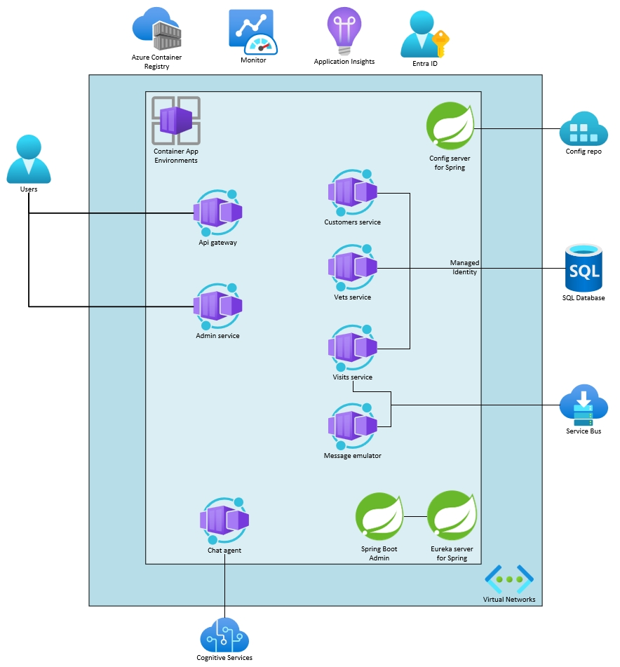

# Lab 11: Set up autoscaling for microservices on ACA

# Student manual

## Lab scenario

Azure Container Apps manages automatic horizontal scaling through a set of declarative scaling rules. These rules allow your application to scale up or down based on specific triggers, such as incoming HTTP requests, TCP connections, or any [ScaledJob](https://keda.sh/docs/2.15/concepts/scaling-jobs/)-based [KEDA scalers](https://keda.sh/docs/2.15/scalers/). 

In this lab, you will learn how to set up autoscaling rules for your applications. This will ensure that your applications are responsive, cost-effective, and capable of handling varying traffic loads efficiently. You can find more information on
- [Set scaling rules in Azure Container Apps](https://learn.microsoft.com/en-us/azure/container-apps/scale-app)

## Objectives

After you complete this lab, you will be able to:

- Update an existing microservice to use an HTTP scaling rule
- Update an existing microservice to set up a custom scaling rule
- Try out the existing microservices

The below image illustrates the end state you will be building in this lab.

## Lab Duration

- **Estimated Time**: 30 minutes

## Instructions

During this lab, you will:

- Update an existing microservice to use an HTTP scaling rule
- Update an existing microservice to set up a custom scaling rule
- Try out the existing microservices

{: .note }
> The instructions provided in this exercise assume that you successfully completed the previous exercise and are using the same lab environment, including your Git Bash session with the relevant environment variables already set.
